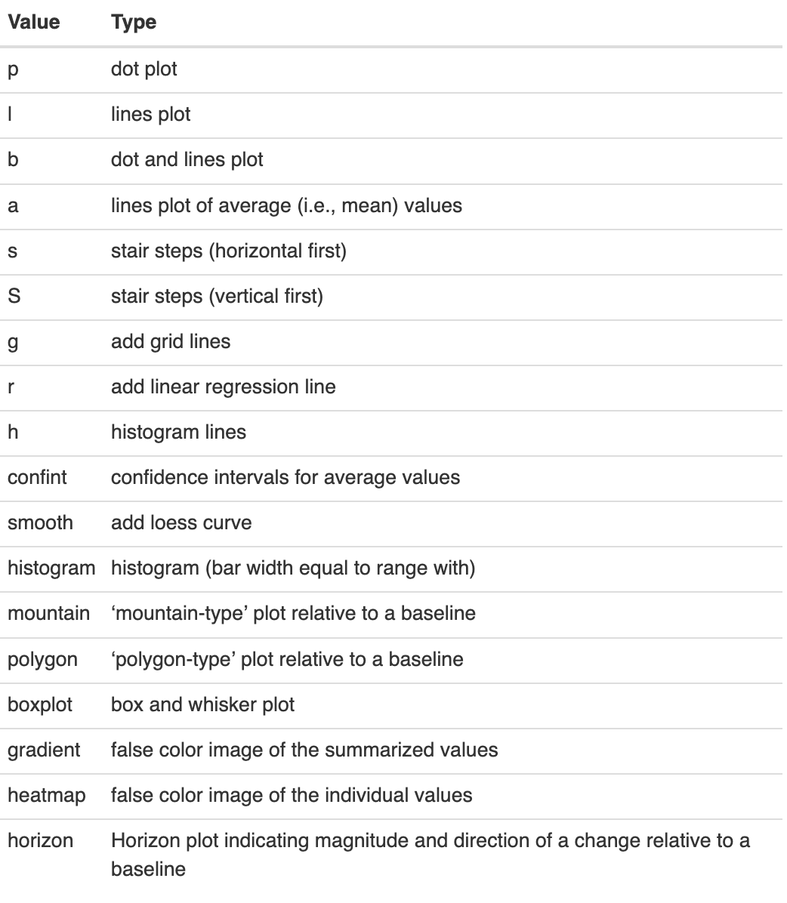

```{r setup, include=FALSE}
knitr::opts_chunk$set(echo = TRUE, fig.width=6, fig.height=2)
```

**PLotting data and annotation information along genomic coordinates**

>Based on User Guide by Florian Hahne^1^ and Robert Ivánek^2,3^
^1^ Novartis Institute for Biomedical Research, Basel, Switzerland
^2^ Department of Biomedicine, University of Basel, Basel, Switzerland
^3^ Swiss Institute of Bioinformatics, Basel, Switzerland


## Introduction

The Gviz package (Hahne and Ivanek 2016) aims to close this gap by providing **a structured visualization framework to plot any type of data along genomic coordinates.** It is loosely based on the GenomeGraphs package by Steffen Durinck and James Bullard, however the complete class hierarchy as well as all the plotting methods have been restructured in order to increase performance and flexibility. All plotting is done using the grid graphics system, and several **specialized annotation classes allow to integrate publicly available genomic annotation data from sources like UCSC or ENSEMBL.**

## Concepts

1. Individual types of genomic features or data are represented by separate tracks.
  
  + AnnotationTrack
  + GenomeAxisTrack
  + IdeogramTrack
  + GeneRegionTrack
  + SequenceTrack
  + DataTrack

2. When combining multiple objects, the individual tracks will always share the same genomic coordinate system.

3. Tracks may contain information for multiple chromosomes, however most of this is hidden except for the currently active chromosome during a given plotting operation.

4. In Bioconductor, genomic features consisting of start and stop coordinates are most often represented as run-length encoded vectors, e.g. IRanges and GRanges classes.

> **Bioconductor**: open source software for Bioinformatics


## Load libraries

```{r packages, eval=FALSE, echo=TRUE, results='hide', message=FALSE}
# suppressWarnings({
#   if (!require("BiocManager"))
#     install.packages("BiocManager", "Gviz")
# })

if (!require("BiocManager"))
    install.packages("BiocManager", "Gviz")

#BiocManager::install("dplyr")
#BiocManager::install("Gviz")
```


```{r libraries, echo=TRUE, message=FALSE}
suppressWarnings({
  library(BiocManager)
  library(GenomicRanges)
  library(Gviz)
  library(biomaRt)
  library(rtracklayer)
})

```


## Annotation Track: AnnotationTrack()

**Generate Track for CpG Islands and plot**

### Import data on CpG islands

```{r CpG}

data(cpgIslands)
class(cpgIslands)

```

### Inspect GRanges object

```{r}
cpgIslands

```

### Retrieve information of genome and sequence

```{r}

chr <- as.character(unique(seqnames(cpgIslands)))
gen <- "hg19"
chr
gen

```


### Generate Annotation Track

```{r, atrack}
atrack <- AnnotationTrack(cpgIslands, name = "CpG")
```

### Plot
```{r, plot}
plotTracks(atrack)
```


## Genome Axis Track: GenomeAxisTrack()

  + Display the genomic coordinates to provide reference.
  + A GenomeAxisTrack object is always relative to the other tracks that are plotted.
  + No need to know in advance about a particular genomic location when constructing the object. The displayed coordinates will be determined from the context, e.g., from the from and to arguments of the plotTracks function, or, when plotted together with other track objects, from their genomic locations.


### Generate GenomeAxisTrack()
```{r gtrack}
gtrack <- GenomeAxisTrack()
```

### Plot
```{r, fig.width=6, fig.height=2}
plotTracks(list(gtrack, atrack))
```


## Chromosome Ideogram Track: IdeogramTrack()

- An ideogram is a simplified visual representation of a chromosome, with the different chromosomal staining bands indicated by color, and the centromere (if present) indicated by the shape.
- We can fetch the chromosome ideogram information directly from UCSC (need an established internet connection for this to work)
- Need to provide the information about a valid UCSC genome and chromosome.
- A plotted track is always defined for exactly one chromosome on a particular genome.
- The chromosomal data necessary to draw the ideogram is not part of the Gviz package itself, instead it is downloaded from an online source (UCSC).

```{r}
#options(Gviz.ucscUrl="http://genome-euro.ucsc.edu/cgi-bin/")

```

Check if you are able to generate the ideogram track. If yes, you can add this track every time you call the function `plotTracks()`.

```{r, itrack}
#itrack <- IdeogramTrack(genome = gen, chromosome = chr)
```


```{r}
plotTracks(list(gtrack, atrack))
#plotTracks(list(itrack, gtrack, atrack))
```

## Let's explore the environment and objects so far!

1. Check the environment

```{r}
ls()
```

2. Check the objects

```{r}
atrack
```


```{r}
atrack@range
```


```{r, results='hide'}
#itrack@bandTable
```


```{r, results='hide'}
#itrack@range
```

### Exercise 1

Change the order of the objects plotted

```{r, include=FALSE}
plotTracks(list(atrack, gtrack))
#plotTracks(list(atrack, itrack, gtrack))
```


## Gene Model information: GeneRegionTrack()

- Display information on gene structure from local source or online resources like UCSC and Ensembl

### Load gene model data from a stored data.frame
```{r}
data(geneModels)
head(geneModels,2)
```

### Generate Track and plot
```{r}
grtrack <- GeneRegionTrack(geneModels, genome = gen,
                           chromosome = chr, name = "Gene Model")
#plotTracks(list(itrack, gtrack, atrack, grtrack))
plotTracks(list( gtrack, atrack, grtrack))
```

```{r}
head(geneModels,2)
```


### Zoom in to the region

```{r}
plotTracks(list(gtrack, atrack, grtrack),
           from = 26700000, to = 26750000)
```


>The layout of the gene model track has changed depending on the zoom level. This is a feature of the Gviz package, which automatically tries to find the optimal visualization settings to make best use of the available space.


## Display the Genomic Sequence at a given position: SequenceTrack()

- The track class SequenceTrack can draw the necessary sequence information from one of the BSgenome packages.
- Create track for a specific chromosome

```{r, eval=FALSE, include=FALSE}
install.packages("BSgenome.Hsapiens.UCSC.hg19")
```


```{r, message=FALSE}
library(BSgenome.Hsapiens.UCSC.hg19)
strack <- SequenceTrack(Hsapiens, chromosome = chr)
plotTracks(list(gtrack, atrack, grtrack, strack), 
           from = 26591822, to = 26591852, cex = 0.8)
```


## Incoorporate Data: DataTrack()

- Annotate genomic coordinate plots with real numeric data
- Different visualization options for these tracks, from dot plots to histograms to box-and-whisker plots.
- The individual rows in a numeric matrix are considered to be different data groups or samples, and the columns are the intervals in the genomic coordinates.


```{r, fig.height=4}
set.seed(255)
lim <- c(26700000, 26750000)
coords <- sort(c(lim[1], 
                 sample(seq(from = lim[1], to = lim[2]), 99), 
                 lim[2]))
dat <- runif(100, min = -10, max = 10)
dtrack <- DataTrack(data = dat, start = coords[-length(coords)],
                    end = coords[-1], chromosome = chr, genome = gen, 
                    name = "Uniform")
plotTracks(list(gtrack, atrack, grtrack, dtrack), 
           from = lim[1], to = lim[2])
```

**Change plot type to *histogram***

```{r}
plotTracks(list(gtrack, atrack, grtrack, dtrack), 
           from = lim[1], to = lim[2], type = "histogram")
```

>**Case Use of the DataTracks**
  + Display the coverage of NGS reads along a chromosome 
  + Show the measurement values of mapped probes from a microarray experiment


## Global Control Parameters

### 1. Specify parameters during Track generation

```{r, fig.height=4}

grtrack <- GeneRegionTrack(geneModels, genome = gen, chromosome = chr, 
                           name = "Gene Model",
                           transcriptAnnotation = "symbol",
                           background.title = "brown")

plotTracks(list(gtrack, atrack, grtrack))
```

### 2. Modify parameters with *displayPars()*

Display track parameters

```{r, results='hide'}
head(displayPars(grtrack))
```
Modify parameters for background colors in the GeneRegion track

```{r}
displayPars(grtrack) <- list(background.panel = "#FFFEDB", background.title = "darkorange")
```


```{r, fig.height=10}
plotTracks(list(gtrack, atrack, grtrack))
```


### 3. Set display parameters for a single plotting operation 
- By passing in additional arguments to the plotTracks function, instead of the permanent setting in the track object 

```{r, fig.height=10}
plotTracks(list(gtrack, atrack, grtrack), 
           background.panel = "#FFFEDB", background.title = "darkblue", fontcolor.title='white')

```


> **Tip!**  
The availableDisplayPars function prints out the available parameters for a class as well as their default values in a list-like structure. 


### Exercise 2

Change the color of the font title:
- 1. In the GeneRegion track
- 2. In all tracks


```{r, fig.height=4, eval=TRUE, echo=FALSE}
displayPars(grtrack) <- list(background.panel = "#FFFEDB", fontcolor.title='black', background.title = "darkorange")
plotTracks(list(gtrack, atrack, grtrack))
```


```{r, fig.height=4, eval=TRUE, echo=FALSE}
plotTracks(list(gtrack, atrack, grtrack), 
           background.panel = "#FFFEDB", background.title = "darkblue", fontcolor.title='orange')
```


## Parameters for Data Track

- To display one or several numeric values that are associated to a particular genomic coordinate range
- When we need to incorporate sample group information


### Input
- a set of ranges, either in the form of an IRanges or GRanges object
- a numeric vector (or matrix) of the same length as the number of ranges

### Import data on multiple replicates for control and treated samples
```{r}
data(twoGroups)
twoGroups
```


```{r}
dTrack <- DataTrack(twoGroups, name = "uniform")
plotTracks(dTrack)
```


```{r}
plotTracks(dTrack, type = c("boxplot", "a", "g"))
```


```{r}
colnames(mcols(twoGroups))
```


```{r}
plotTracks(dTrack, type = c("heatmap"), showSampleNames = TRUE, 
           cex.sampleNames = 0.6)
```

### Integrate information of data grouping
- Samples are grouped together based on a factor variable (e.g. control, treated).
- The grouping is reflected in the layout of the respective track types. 
- Grouping is not supported for all plotting types

```{r}

plotTracks( dTrack,  
            groups = rep(c("control", "treated"), each = 3), 
            type = c("a", "p", "confint"), 
           from=1, to=1030, genome='hg19', chromosome='chrX'
           )

```




### Exercise 3

Display tracks for chromosome ideogram and genome coordinates

```{r, eval=FALSE, echo=FALSE, include=FALSE}

plotTracks( list(itrack,dTrack),  
            groups = rep(c("control", "treated"), each = 3), 
            type = c("a", "p", "confint"), 
           from=1, to=1030, genome='hg19', chromosome='chrX'
           )

```

>Tip: Check the chromosome!


```{r, eval=TRUE, include=FALSE}
#itrack_chrX <- IdeogramTrack(genome = gen, chromosome = 'chrX')
```


```{r, eval=TRUE, include=FALSE, fig.height=4}
plotTracks( list(gtrack,grtrack,dTrack),  
            groups = rep(c("control", "treated"), each = 3), 
            type = c("a", "p", "confint"), 
           from=1, to=1030, genome='hg19', chromosome='chrX'
           )
```


## Parameters for Alignment Track

```{r}

afrom <- 44945200
ato <- 44947200
alTrack <- AlignmentsTrack(
  system.file(package = "Gviz", "extdata", "snps.bam"), isPaired = TRUE)
plotTracks(alTrack, chromosome = "chr21", from = afrom, to = ato)

```

```{r, fig.height=10}
plotTracks(alTrack, strack, chromosome = "chr21", from = afrom, to = ato)
```


```{r, fig.height=10}
plotTracks(c(alTrack, strack), chromosome = "chr21",
           from = 44946590, to = 44946660)
```


```{r, fig.height=10, fig.width=10}
plotTracks(c(alTrack, strack), chromosome = "chr21", from = 44946590, 
           to = 44946660, cex = 0.5, min.height = 8)
```


