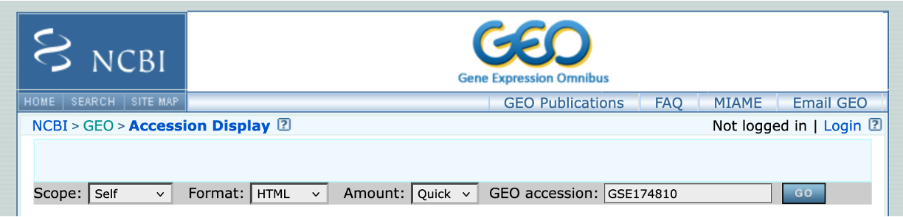

**GRanges**

The GenomicRanges package serves as the foundation for representing genomic locations. We will use the operations implemented in the GenomicRanges and related packages to run jobs typically performed in the context of a high throughput sequence analysis.

**Objectives**

  - Introduction to GRanges class
  - Explore main functions for handling GRanges objects
  - Work with GRanges and dplyr
  - Import and inspect a GTF file
  - Define TSS genomic positions
  - Intersect TSS windows with TF-bound genomic intervals


## Install and load 

``` {r, message=FALSE}
if (!require("BiocManager"))
    install.packages("BiocManager")

if (!require("GenomicRanges"))
  BiocManager::install("GenomicRanges")
```

``` {r, message=FALSE}
library(GenomicRanges)
library(ggplot2)
library(dplyr)
library(curl)
#library(plyranges)
```


## The Genomic Range Object

The GRanges class defines a set of genomic ranges, each characterized by a single start and end position on the genome. It is commonly used to store the locations of genomic features such as contiguous binding sites, transcripts, and exons. GRanges objects can be created using the GRanges constructor function. For instance:

``` {r}
gr <- GRanges(
    seqnames = Rle(c("chr1", "chr2", "chr1", "chr3"), c(1, 3, 2, 4)),
    ranges = IRanges(start = 101:110, end = 111:120, names = head(letters, 10)),
    strand = Rle(strand(c("-", "+", "*", "+", "-")), c(1, 2, 2, 3, 2)), # strand --> without double quotes
    score = 1:10,
    GC = seq(1, 0, length=10))
gr
```

The output of the GRanges displays information in two sections separated by a `|` symbol. Genomic coordinates (including `seqnames`, `ranges`, `strand`, `names`) appear on the left-hand side, while metadata columns (annotations) are shown on the right. In the above example, the metadata includes `score` and `GC` content, although the metadata section of a GRanges object can store a wide variety of information.


``` {r}
class(gr)
length(gr)
```


An Rle (run-length-encoded) vector is a specific representation of a vector. For more information have a look at:
<https://kasperdanielhansen.github.io/genbioconductor/html/GenomicRanges_Rle.html>. The IRanges function defines interval ranges.


### Extract idividual components of the GR object

The genomic coordinate components of a GRanges object can be accessed using the `seqnames`, `names`, and `strand` functions.

``` {r}
# Extract chromosome names
seqnames(gr)
```


``` {r}
# Extract the strand
strand(gr)
```

``` {r}
# Extract the names
names(gr)
```


```{r}
# Extract the start position
start(gr)
```


### Basic interval operations

The genomic ranges can be extracted without corresponding metadata with `ranges` or `granges`


```{r}
ranges(gr)
```


``` {r}
# Extract genomic ranges without annotations
granges(gr)
```

What is the length of the genomic regions? 
One might want to plot the peak length distribution for called peaks. GRanges can provide this in one function. 

``` {r}
# Extract the width
width(gr)
```

### Extracting annotations

``` {r}
# Extract annotations
mcols(gr)
mcols(gr)$GC
```

``` {r}
# Reverse GRanges
#rev(gr)
```


### Subset GRanges objects

Standard subsetting methods similar to R vectors and lists can be used to subset GRanges objects.

Subset specific intervals
``` {r}
gr[c('a','d')]
gr[2:3]
```

Select and filter specific metadata
```{r}
gr[2:3, c('GC','score')]
```
```{r}
gr[gr$GC>0.7]
```


## `plyranges`

Can we use dplyr functions with GRanges objects?

```{r, eval=FALSE}
gr %>% select(GC)
```


In general, `dplyr` functions do not directly apply on a GRanges object, because GRanges is a special Bioconductor object and not a standard data frame or tibble. One option is to convert a GRanges object to a tibble or data.frame using as.data.frame() or as_tibble(), and then use dplyr functions like select(), filter(), mutate(), etc. Following manipulation, it can be converted back to a GRanges object if needed.


`makeGRangesFromDataFrame` uses as input a data-frame-like object and automatically finds the columns that describe genomic ranges. It then returns them as a GRanges object. A number of arguments control the behaviour of the function and modify the output GRange object.

What is the purpose of the `keep.extra.columns` option?

```{r}
# Convert to a dataframe, filter with dplyr, and re-convert to a GRanges object
gr_df <- as.data.frame(gr)
gr_df <- gr_df %>% filter(GC>0.7) %>% select(-strand)

# Convert data.frame to GRanges object 
makeGRangesFromDataFrame(gr_df, keep.extra.columns = TRUE)

```

Alternatively, one can use `plyranges`, a Bioconductor package that extends dplyr-style syntax directly to GRanges objects.

```{r, eval=FALSE}
#BiocManager::install("plyranges")
```

```{r}
library(plyranges)
gr %>% filter(GC>0.7)
```


```{r}
# Convert GRanges object to a dataframe 
gr %>% as.data.frame() %>% head()
```


> Not all `dplyr` functions are compatible with GRanges object. In some cases you need to convert to a tibble and then back to a GR object.


## Import GTF for Homo sapiens

GRanges provides a flexible framework for importing, inspecting, and processing GTF (Gene Transfer Format) files. Here, we will retrieve a GTF file containing genomic annotations for Homo sapiens from the Ensembl FTP server. We will use the `import` function from the rtracklayer package to fetch the gtf file.

``` {r}
# Import library
library(rtracklayer)
```

``` {r}
# Define the FTP URL
ftp_url = "ftp://ftp.ensembl.org/pub/release-106/gtf/homo_sapiens/Homo_sapiens.GRCh38.106.chr.gtf.gz"

```

``` {r}
# Import gtf as GRange object
options(timeout = 1000)
gtf <- rtracklayer::import(ftp_url)
```

``` {r}
# View GRanges 
gtf %>% head()
```

### Inspect the GTF file

Check the metadata information contained in the GTF file
```{r}
# Check the metadata information
mcols(gtf) %>% names()
```

Notice that GRanges was able to properly tabulate the information contained in the 9th column of the GTF file. This wouldn't be as efficient using the `read.table()` function.


What are the different type of intervals? 

``` {r}
# Inspect the levels in the `type` column
#gtf %>% count(type)
gtf %>%
  group_by(type) %>%
  summarise(n = n())
```

How many unique protein-coding genes there are in the gtf?

``` {r, include=FALSE}
pcg.gr <- split(gtf, mcols(gtf)$type=='gene' & 
             mcols(gtf)$gene_biotype=='protein_coding' & 
             !is.na(mcols(gtf)$gene_name) &
             !duplicated(mcols(gtf)$gene_name)
             #mcols(gtf)$source=='ensembl_havana'
            )$`TRUE`

length(pcg.gr)
```


```{r}
# Using dplyr with additionally removing duplicate genes
pcg <- gtf %>% 
      as_tibble() %>%
      filter(type=='gene' & gene_biotype=='protein_coding' & !is.na(gene_name)) %>%
      distinct(gene_name, .keep_all = TRUE) %>%
      makeGRangesFromDataFrame(keep.extra.columns = TRUE)

length(pcg)
class(pcg)
```

```{r, include=FALSE}
# Identify duplicates
dupl <- gtf %>% 
      as_tibble() %>%
      filter(type=='gene' & gene_biotype=='protein_coding' & !is.na(gene_name)) %>%
      group_by(gene_name) %>%
      filter(n()>1) 
      #%>%
      #ungroup()
      
dupl

```


### Drawing plots of metadata information

Tabulate the number of genes per chromosome
``` {r}
seqnames(pcg) %>% table()
```


Plot the number of unique protein-coding genes per chromosome. In this case, we do not filter for protein-coding genes.
``` {r}
# PLot by chromosome
options(repr.plot.width=28, repr.plot.height=4)

pcg %>% 
    as.data.frame() %>% 
    #group_by(seqnames, gene_biotype) %>%
    summarize(.by=c(seqnames, gene_biotype), count = n()) %>%
    ggplot(aes(x = seqnames, y = count, fill=gene_biotype)) +
      geom_bar(stat = 'identity', position = 'dodge') +
      theme_classic() +
        theme(axis.title=element_text(size=14), axis.text = element_text(size=14),
        legend.title=element_blank(), legend.text = element_text(size=14),      
        axis.text.x = element_text(angle = 45, vjust=1, hjust = 1))
```

Plot the different genes types per chromosome

``` {r, fig.width=20, fig.height=6}
# PLot by chromosome

gtf %>%
    as.data.frame() %>% 
    filter(type=='gene' & !is.na(gene_name)) %>%
    group_by(seqnames, gene_biotype) %>%
    summarize(count = n()) %>%
    ggplot(aes(x = seqnames, y = count, fill=gene_biotype)) +
      geom_bar(stat = 'identity', position = 'dodge') +
      theme_classic() +
        theme(axis.title=element_text(size=14), axis.text = element_text(size=14),
        legend.title=element_blank(), legend.text = element_text(size=14), legend.position = 'bottom',     
        axis.text.x = element_text(angle = 45, vjust=1, hjust = 1))
```

```{r, eval=FALSE, include=FALSE}
.groups	
[Experimental] Grouping structure of the result.

"drop_last": dropping the last level of grouping. This was the only supported option before version 1.0.0.

"drop": All levels of grouping are dropped.

"keep": Same grouping structure as .data.
```


Plot the distribution across chromosomes per each gene type. Which gene type is the most abundant?

``` {r, fig.width=20, fig.height=6}
options(repr.plot.width=20, repr.plot.height=8)

gtf %>%
    as.data.frame() %>%
    filter(type=='gene' & !is.na(gene_name)) %>%
    group_by(seqnames, gene_biotype) %>%
    summarize(count = n()) %>%
    ggplot(aes(x = gene_biotype, y = count, fill=seqnames)) +
      geom_bar(stat = 'identity', position = 'dodge') +
      theme_classic() +
        theme(axis.title=element_text(size=14), axis.text = element_text(size=14),
        legend.title=element_blank(), legend.text = element_text(size=14),      
        axis.text.x = element_text(angle = 45, vjust=1, hjust = 1))
```


## Defining the TSS of transcripts

In genomic analyses, we often need to generate a file containing **transcription start site (TSS) positions or windows surrounding the TSS**. This regions are important for **defining promoter areas**, where the regulation of gene expression primarily occurs. TSS-centered regions are also crucial for performing downstream analyses, e.g. motif discovery for transcription factors, or assessing the overlap with accessible regions (derived from ATAC-seq data) or regions of histone mark occupancy and transcription factor binding (ChIP-seq data).  

GTF files are the primary source from where we can extract TSS positions. Here, we will identify the TSS of transcripts and create a window around them that spans 1000 bases upstream and 500 bases downstream of the TSS. 

First we will retrieve all transcripts. We will filter for **ensembl_havana annotated transcripts**. HAVANA stands for Human And Vertebrate Analysis and Annotation. These are manually curated annotations (Wellcome Sanger Institute) integrated with the automatic annotation of Ensembl. 

```{r, }
tx <- gtf %>% 
    as_tibble() %>%
    filter(type == "transcript" & source == "ensembl_havana" & !is.na(transcript_name)) %>%
    #distinct(transcript_name, .keep_all = TRUE) %>%
    makeGRangesFromDataFrame(, keep.extra.columns = TRUE)

length(tx)
head(tx,2)
    
```


To create TSS genomic coordinates, we will define TSS as start position for the '+' strand and end position for the '-' strand. Here, we use the `ifelse()` function to define the position: if strand is positive, then start equals to tx start position, otherwise (when strand is not positive) start equals to tx end position.


``` {r}
# Define TSS as start position for '+' strand and end position for '-' strand
tss <- GRanges(
  seqnames = seqnames(tx),
  ranges = IRanges(
    start = ifelse(strand(tx) == "+", start(tx) , end(tx)),
    end = ifelse(strand(tx) == "+", start(tx), end(tx))
  ),
  strand = strand(tx),
  gene_name = tx$gene_name,  
  gene_id = tx$gene_id 
)

length(tss)
head(tss, 4)
```

Export the file with TSS genomic positions in BED format.
``` {r}
export(tss, "../results/TSS.bed", format = "BED")
```


GRanges has dedicated method for doing the same job, called `resize()`.
Let's use the `resize` method to define the TSS

``` {r, }
# Alternative way to define TSS with the resize method

tss.2 <- gtf %>% .[mcols(.)$type=='transcript'] %>%
                 .[mcols(.)$source=='ensembl_havana' & !is.na(mcols(.)$transcript_name)] %>%
                  resize(., 1) %>%
                  .[,c('gene_name','gene_id')] 

export(tss.2, "../results/TSS_v2.bed", format = "BED")
length(tss.2)
head(tss.2)
```

Verify that we got the same results
```{r}
identical(tss, tss.2)
```


Try to define a window spanning the TSS 1000 bases upstream and 500 bases downstream. The upstream and downstream arguments define the number of nucleotides in the 5' and 3' direction, respectively.

``` {r}
# Define a 100 bp window around the TSS

tss_window <- GRanges(
  seqnames = seqnames(tss),
  ranges = IRanges(
    start = pmax(start(tss) - 1000, 1),  # Ensures start position is >= 1. Returns the maximum value. 
    end = end(tss) + 500
    ),
  #strand = strand(tss)
  gene_name = tx$gene_name,  
  gene_id = tx$gene_id 
)

# View result
head(tss_window, 4)
```

We can use the *intra range transformation* `promoter()` function of GRanges to do the same job. The output range is defined as

    (start(x) - upstream) to (start(x) + downstream - 1)
      
for ranges on the + or * strand, and as

    (end(x) - downstream + 1) to (end(x) + upstream)
      
for ranges on the - strand
 
```{r}
tss_window <- promoters(tx, upstream=1000, downstream=500) %>% .[,c('gene_name')]
#export(tss_window, "../results/TSS_window.bed", format='BED')
tss_window %>% head(4)

```


## Intersect with TF-bound regions 

One common question in the analysis of genomic intervals is what are the genes regulated by various trascription factors, or other members of the transcriptional machinery. In that case, we might want to compare the TSS intervals of genes to regions bound by a transcription factor.

We will determine the overlap between genomic regions bound by BATF, a pioneer transcription factor, and promoter intervals to identify genes potentially regulated by BATF. The BATF genomic regions derive from an experiment where naive CD4+ T cells isolated from human umbilical cord blood were in vitro polarized to Th17-fate for 72h and further subjected to BATF ChIP analysis. Genome-wide ChIP-seq reads were aligned to the hg38 genome assembly. The data is deposited in the public repository Gene Expression Omnibus (GEO) with accession id GSE174810. The latter is a SubSeries which is is part of SuperSeries GSE176065.

[**GEO**]<https://www.ncbi.nlm.nih.gov/geo/>

*GSE174810: Genome-wide binding sites of FOSL1, FOSL2 and BATF in human Th17 cells [ChIP-seq]*

<center>

{width="600"}

</center>


### Retrieve data from GEO

We will fetch the supplementary files with the GEOquery function `getGEOSuppFiles()`. This will download the files in a directory named according to the GEO accession id. We can then untar/unzip the file and import the files we need. We will try different ways to achieve this:

`getGEO()` is the main user-level function in the GEOquery package. For more information, check out the package vignette [GEOquery](https://bioconductor.org/packages/devel/bioc/vignettes/GEOquery/inst/doc/GEOquery.html).


```{r}
library(GEOquery)
```


```{r, include=FALSE}
# gse <- getGEO("GSE174810", GSEMatrix = FALSE)
# show(gse)
```

1. Download supplementary files

Check the path to the current directory in order to understand where the file is downloaded.  

```{r, eval=FALSE}
getwd()
```

Download data from a GEO
```{r, eval=FALSE}
# Download data from a GEO and list files
#setwd('../')
getGEOSuppFiles("GSE174810")
```

Check that the tar file has been downloaded 
```{r}
list.files('../GSE174810/')
```

Check the list of files in the tar
```{r, eval=FALSE}
untar("GSE174810/GSE174810_RAW.tar", list = TRUE)
```

To untar directly from R we can use the built-in `untar()` function.
```{r}
untar("../GSE174810/GSE174810_RAW.tar", exdir = "../GSE174810/GSE174810_RAW")
```

List the supplementary files
```{r}
list.files('../GSE174810/GSE174810_RAW/')
```


Import the file of interest, e.g. BATF_R1_peaks, by providing the connection `con` from which data is loaded. 
```{r}
library(rtracklayer)
# R.utils::gunzip("../GSE174810/GSE174810_RAW/GSM5328649_BATF_R1_peaks.narrowPeak.gz", 
#                 overwrite = TRUE)

file_path <- "../GSE174810/GSE174810_RAW/GSM5328649_BATF_R1_peaks.narrowPeak.gz"

#Does the file exist?
file.exists(file_path)
```


```{r}
options(timeout = 1000)
batf <- import(con=file_path, format = "narrowPeak")
#dim(bed)
batf %>% head(2)
```


2. Retrieve the file from GEO providing a URL.
``` {r}
# Define URL
batf_url <- "https://ftp.ncbi.nlm.nih.gov/geo/samples/GSM5328nnn/GSM5328649/suppl/GSM5328649%5FBATF%5FR1%5Fpeaks%2EnarrowPeak%2Egz"
```

```{r}
# error when rtracklayer::import is used directly on a remote .gz file

# Download first
destfile <- "../GSE174810/BATF_peaks.narrowPeak.gz"
download.file(batf_url, destfile = destfile)

# Then import it
batf <- import(con = destfile, format = "narrowPeak")
batf %>% head()
```


``` {r, include=FALSE}
# library(data.table)
# 
# batf_url <- "https://ftp.ncbi.nlm.nih.gov/geo/samples/GSM5328nnn/GSM5328649/suppl/GSM5328649%5FBATF%5FR1%5Fpeaks%2EnarrowPeak%2Egz"
# 
# # Read compressed BED file
# batf_df <- fread(cmd = paste("curl -s", batf_url, "| gunzip -c"), header = FALSE)
# 
# # View first few rows
# head(batf_df, 2)
```


> Let us check the length distribution of the intervals

```{r, fig.width=4, fig.height=4}
mean(width(batf))

#mcols(batf)$width <- width(batf)

batf %>% 
  as.data.frame() %>% 
  ggplot(aes(width)) + 
    geom_density() + 
    scale_x_continuous(trans='log2') +
    geom_vline(xintercept=mean(width(batf)), color="red", linewidth=0.1 ) +
    theme_classic()

# log2(width) returns log2 values on the x-axis, whilst scale_x_continuous() keeps the original values.

```


Check the seqnames. You will notice that it contains seqnames not present in the tss_window()
```{r}
seqnames(batf) %>% table()
```

From the UCSC site:

Chr*N*_random relates to sequence that is known to be in a particular chromosome, but could not be reliably ordered within the current sequence. ChrUn contains clone contigs that cannot be confidently placed on a specific chromosome. For the chrN_random and chrUn_random files, we essentially just concatenate together all the contigs into short pseudo-chromosomes. The coordinates of these are fairly arbitrary, although the relative positions of the coordinates are good within a contig. You can find more information about the data organization and format on the [Data Organization and Format page](https://genome.ucsc.edu/goldenPath/datorg.html).


To be able to intersect the two GRanges objects, **the seqnames need to match**. We need to modify the seqnames() of the `batf GR object` to match the levels of the `tss_window GR object`. To keep it simple, we will only change the seqnames for the autosomal chromosomes (1:22) plus chromosomes X and Y. It is also important to ensure that the genomic positions refer to the same genome assembly, in this case the human build 38!


```{r}
# Seqnames of tss_window
seqnames(tss_window) %>% table()
```


## Convert seqnames of BATF GR object

```{r}
# Modify seqnames
#remove_seqnames <- "chrM|chrUn|chrEBV|random"
#batf <- batf[!(grepl(remove_seqnames, seqnames(batf)) ) ]
#batf <- keepSeqlevels(batf, 
#           seqlevelsInUse(batf), 
#          pruning.mode="coarse" #Remove the elements in x where the seqlevels to drop are in use.
#          ) 

seqlevels(batf) <- sub("^chr", "", seqlevels(batf))

```

```{r}
seqnames(batf) %>% table()
```


```{r, include=FALSE}
# batf  %>% filter(seqnames=='1' & start >1003032 & start < 1023271) %>% arrange(seqnames,start)
# tss_window  %>% filter(seqnames=='1' & start >1003032 & start < 1023271) %>% arrange(seqnames,start)
```


We will use the `subsetByOverlaps` method of GRanges to extract the elements in the query (e.g. TSS) that overlap at least one element in the subject (e.g. batf).
```{r}
overlap <- subsetByOverlaps(tss_window, batf)
overlap
```

>Can you tell what the warning is about?


Now we can retrieve the genes, whose promoter is bound by the BATF transcription factor.
```{r}
genes <- overlap$gene_name %>% unique() %>% sort()
length(genes)
head(genes)

```


## Range-based transformations are grouped in 2 categories:

        
1. Intra range transformations (e.g. shift()) **transform each range individually** (and independently of the other ranges). They return an object parallel to the input object, that is, where the i-th range corresponds to the i-th range in the input. Those transformations are described in the intra-range-methods man page (see ?`intra-range-methods`).

2. Inter range transformations (e.g. reduce()) transform all the ranges together as a set to produce a new set of ranges. They return an object that is generally NOT parallel to the input object. Those transformations are described below.


### Intra-range functions

Operate on each element of a GRanges object independently of the other ranges in the object.

For instance, the `flank` method allows you to generate regions flanking the existing ranges in a GRanges object in a strand dependent manner. To capture the 10 bases located upstream of these ranges:

``` {r}
g <- gr[1:3]
g
flank(g, 10)
```

To include the downstream bases:

``` {r}
flank(g, 10, start=FALSE)
```

We can shift the ranges by a specific number of bases with `shift`. This is performed is a strand independent manner.

``` {r}
# Shift (same direction) both start and end by N bp 
shift(g, -5)
```

The `resize` method will extend the ranges by a specified width from the start in a strand dependent manner.

``` {r}
# Rize width to N bp (from start)
resize(g, 5)
```


### Inter-range functions

Transform all the ranges together as a set to produce a new set of ranges.


```{r}
gr
```

1. Align the ranges and merge overlapping ranges to produce a simplified set. It maintains information related to the strand.

``` {r}
#Merge overlapping intervals
reduce(gr) %>% arrange(start)
```


2. Retrieve the gaps between the ranges

For example, it might be useful to retrieve all regions not bound by a transcription factor to interrogate further.

``` {r}
# Retrieve the gaps between the intervals
gaps(gr)
```


3. A collection of non-overlapping ranges

Rather than merging intervals that overlap by 1 bp, it retrieves the complete overlapping plus non-overlapping regions.

``` {r}
# Returns the non-overlapping regions
disjoin(gr)
```


4. Quantify the degree of overlap for all the ranges in a GRanges object.

``` {r}
# Example GRanges object
g <- GRanges(seqnames = c("chr1", "chr1", "chr2"),
             ranges = IRanges(start = c(1, 3, 4), end = c(4, 6, 7)),
             strand = rep('+',3)
             #strand = Rle(strand('+'),3)
             #strand = Rle(rep('+',3))
             )

# = Rle(strand(c("-", "+", "*", "+", "-")), c(1, 2, 2, 3, 2))
g
```

``` {r}
coverage(g)
```


``` {r}
# Convert to dataframe
# Compute coverage (returns an RleList)
covg <- coverage(g)

# Convert coverage to a data frame
df_list <- lapply(names(covg), function(chr) {
  data.frame(
    seqnames = chr,
    position = seq_along(covg[[chr]]),  # Positions along the chromosome
    coverage = as.vector(covg[[chr]])   # Convert Rle to numeric vector
  )
})

# Combine into a single data frame
df <- do.call(rbind, df_list)
df
```


## Interval set operations for GRanges objects

Perform operations between two GRanges objects.

``` {r}
g <- gr[1:3]
g2 <- head(gr, n=2)

g
g2

```


Retrieve the union of regions.

``` {r}
# Combined ranges
GenomicRanges::union(g, g2)
```

Retrieve overlapping regions.

``` {r}
# Overlapping regions
GenomicRanges::intersect(g, g2)
```

Retrieve the non-overlapping regions.
``` {r}
# Non overlapping regions
GenomicRanges::setdiff(g, g2)
```


## Splitting and combining GRanges objects

GRanges objects can be divided into groups using the `split` function. This produces a GRangesList object.

``` {r}
# Split using a factor that defines the grouping `rep(1:2, each=5)`. Use `time` instead of `each`.
sp <- split(gr, rep(1:2, each=5))
sp
```

Set the names of the two items in the list
```{r}
# Name the two elements of the lists
names(sp) <- c('A','B')
```

Check the length of each item
```{r}
lengths(sp)
```

```{r}
# Retrieve the first item in the list
#sp[[1]]
sp$A
```

Concatenate the two lists
``` {r}
# Concatenate 
c(sp[[1]], sp[[2]])
```

A useful and fast strategy is to unlist the GRangesList to a GRanges object, operate on the GRanges object, then relist the result.

``` {r}
# Unlist into a GRanges object
unlist(sp)
```

Splitting can be performed based on genomic coordinate information or metadata.

``` {r}
# Split by chromosome
singles <- split(gr, seqnames(gr))
names(singles)
singles
```


``` {r}
# Split based on metadata information
singles <- split(gr, mcols(gr)$score<4)
singles
```

How would you split for start position less than 106 and GC more than 0.7

``` {r, include=FALSE}
# Split and take the first element in the GRangeslist
split(gr, start(gr)<106 & mcols(gr)$GC>0.7 )
```

It is also possible to append an interval to the GRanges object
``` {r}
# Append to the ranges
g <- gr[1:3]
g <- append(g, singles[[1]][1])
g
singles[[1]][1]
```

Or replace a genomic interval
``` {r}
# Replace a genomic interval
g[2] <- singles[[1]][2]
g

singles[[1]][2]
```

Replace a value of a genomic interval
```{r}
# Replace the strand in the second interval
mcols(g)$score[3] <- 10
strand(g[2]) <- '+'
g
```


``` {r}
# gr[IRanges(start=c(2,7), end=c(3,8))] # genomic intervals [2:3] and [7:8]: from 2nd to 3rd row and from 7th to 8th row
# gr %>% filter(start<107, start>102)
```


``` {r}
#help("inter-range-methods", package = "GenomicRanges")
#?`inter-range-methods`
```


> GRanges offers parallel methods when two  objects have matching structures, e.g. element 1 of one object corresponds to element 1 of the other. These methods, which start with "p" (for parallel), perform element-wise operations like unions. Both objects must have the same number of elements, with matching seqnames and strand throughout.


## Online Resources and Databases for omics data

The section below briefly introduce you to the description and usage of some very useful online resources for ChIP-seq public data and also other omics data. 
Take a closer look to explore them, you might need them in the future in order to complement your future experiments! 

### Poor man’s guide to omics

When approaching a new problem, you might conceive **multiple hypotheses** that could instruct a wide variety of experimental approaches. 
However, you have neither the time, nor the money or the inclination to perform all of these experiments. Chances are, though, that somewhere in a server there is a dataset that can help you, be it a ChIP-seq dataset or any other omic. They may not give you an answer outright, but they’ll help you **prune your hypotheses** and only keep the ones that have some foundation.
After all, while big data analysis often results in false positives, or at least positives that are contingent to a specific model, it is very useful to avoid pursuing roads for which no evidence is found in datasets. 

This section aims to give you **resources** that you can employ to perform simple analyses that prevent you from wasting your time and allow you to focus on the experiments that matter.

Over the years, multiple consortia have assembled these datasets into curated collections, and new datasets are published with almost every new paper, neatly stored into various sites. 

Here we provide a handful of **key databases** and characteristics of the main ones, as well as a list of other databases that may be useful for more specific questions.

#### ENCODE: the encyclopedia of DNA elements
The closest to the object of the workshop, over more than 20 years of activity the ENCODE consortium is the biggest effort in **functional genomics** in the world, assembling thousands of datasets. You can easily browse their portal by theme and find ready-made datasets that pertain to your field. Once you have your dataset (or datasets) of choice, you only have to browse it with the help of this workshop’s scripts or visualize it, for example with IGV.

[Encode project](https://www.encodeproject.org/)

#### GEO: The Gene Expression Omnibus
This portal is almost ubiquitous in publications - in fact, nearly all **gene expression datasets** used in publications, both bulk and single cell, are published on the GEO, a service handled by the NCBI. The GEO datasets can be accessed from papers, but also directly from the portal, and the neat thing is that they are generally well annotated so that you can understand how specific experiments were performed. They have specific files that tell you how the data was generated.
This kind of information can be complementary to epigenome data, or can inform derivative work giving you invaluable insight into a model you want to adopt. 

[Gene Expression Omnibus](https://www.ncbi.nlm.nih.gov/geo/)

#### TCGA: The Cancer Genome Atlas
Among the biggest efforts in contemporary medical research, spearheaded by the NIH. The Cancer Genome Atlas has gathered **transcriptomics, methylation, and chromatin accessibility** data for an incredibly wide array of malignancies, and it keeps expanding with new cohorts of patients, curated by individual contributors. While it is a specific resource pertaining to oncology, its wealth of controls and diversity of malignancies makes it invaluable for anybody working on human biology - after all, most fundamental biology experiments are performed on cancer cell lines.

[The Cancer Genome Atlas](https://www.cancer.gov/ccg/research/genome-sequencing/tcga)

#### The Human Cell Atlas
Arguably the biggest ongoing sequencing project in the world, the Human Cell Atlas aims to fully leverage **single cell transcriptomes** to define every *cell type* in the human body. Currently hosting data for close to **60 million** sequenced cells and still counting, this is the largest single-cell resolved gene expression resource currently available for non-diseased tissue. Allows downloads in formats that are ‘easily’ browsed - meaning you don’t have to do core processing yourself.

[The Human Cell Atlas - HCA](https://data.humancellatlas.org/)

#### Additional links:
[Roadmap consortium](https://egg2.wustl.edu/roadmap/web_portal/)
Generated tracks for multiple modifications, and produced ChromHMM to sort them out

[EBI Bioimage Archive](https://www.ebi.ac.uk/bioimage-archive/)
European resource for bioimages. Pretty unique and specific, rare type of datasets.

[GTEX](https://gtexportal.org/home/)
Tissue-specific genotype regulation - a complex database that can tell you whether your gene of interest works in the context you study.

[Brown university collection](https://libguides.brown.edu/c.php?g=545426&p=3741199)
Collection of resources, including some of those we showed above. Take a look when you need to find some new source of data!

[NIH’s collection - even better than Brown’s!](https://www.nlm.nih.gov/NIHbmic/domain_specific_repositories.html)
Includes even more well-categorized resources.


