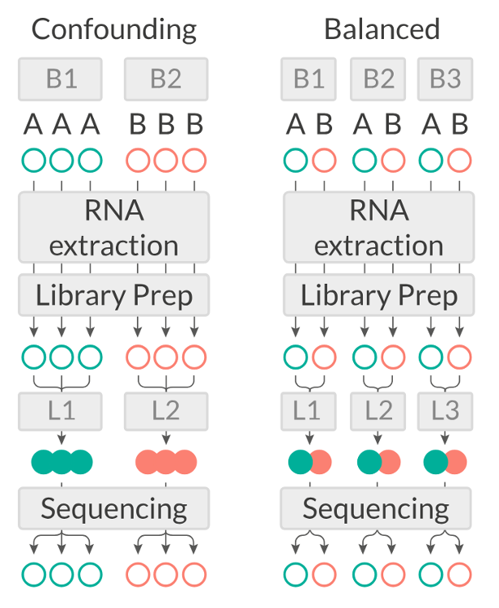

## Objectives

-   Introduction to ChIP-seq
-   Dataset introduction and exploration
-   Data normalization with `edgeR`
-   Diagnostic and exploratory analysis
-   Resources for ChIP-seq and other omics data


```{r setup, include=FALSE}
knitr::opts_chunk$set(engine = 'R', echo = TRUE, fig.align = 'center', warning = FALSE, message = FALSE, class.output = ".bordered")
library(kableExtra)
library(dplyr)
```


## Install the packages

The analyses we are going to perform require specific *functions* that are not included in the basic set of functions in R. These functions are collected in specific *packages*. R packages are extensions to the R programming language that contain code, data and documentation which help us performing standardized workflows. In the chunk below, we instruct R to install the packages that we will need later on through the workshop.

> We have already installed the necessary packages. However, if a library is not present copy the relevant command line and paste it to your R script.

```{r, eval=FALSE }
# # Install packages from Bioconductor
# if (!require("BiocManager", quietly = TRUE))
#   install.packages("BiocManager")
# 
# # Install packages from CRAN
# #install.packages("tidyr")
# #install.packages("dplyr")
# #install.packages("googledrive")
# 
# # For differential analysis
# BiocManager::install("vsn")
# BiocManager::install("edgeR")
# install.packages("statmod")
# 
# # For visualizations
# install.packages("hexbin")
# install.packages("pheatmap")
# #install.packages("RColorBrewer")
# #install.packages("ggrepel")
# #install.packages("circlize")
# 
# # For downstream analysis
# install.packages("gprofiler2")
# 
# # Clean garbage
# gc()
```


During installation of packages, you will see many messages being displayed on your R console, you usually need to pay attention to them if they are **red and specify an error**!

If you encounter any of the messages below during installation, follow this procedure here:

```{r, eval=FALSE}
# R asks for package updates, answer "n" and type enter
# Question displayed:
Update all/some/none? [a/s/n]:

# Answer to type:  
n

# R asks for installation from binary source, answer "no" and type enter
# Question displayed:
Do you want to install from sources the packages which need compilation? (Yes/no/cancel)

# Answer to type:
no
```


## The ChIP-seq dataset

The dataset we will analyze comes from this paper published from our lab in 2021:

> Della Chiara, Gervasoni, Fakiola, Godano et al., 2021 - Epigenomic landscape of human colorectal cancer unveils an aberrant core of pan-cancer enhancers orchestrated by YAP/TAZ

Its main object was to explore the way cancer cells use enhancers as opposed to nonmalignant cells, and we did so by using **ChIP-seq on histone marks** extensively. We generated **organoid lines to model colorectal tumors**, analyzed their epigenome, and compared it to the ATAC-seq-derived chromatin activity data of multiple other malignancies. We found a small number of **enhancer sequences were conserved** across all these types, and identified a transcription factor that linked them - the YAP/TAZ pair - that when perturbed would cause the death of malignant, but not normal, organoids, therefore representing a potential pan-cancer therapeutic target.


> ✅ In this workshop, we will re-analyze a portion of the ChIP-seq dataset used in the paper, pertaining to **Histone 3 Lysine 27 Acetylation** - a marker of activation present at active regulatory sequences, enhancers and promoters alike.

## Load and explore the dataset

In order to speed up the computations and keep memory usage low, we have **subset the dataset only to chromosome 12**. It will be interesting to see if we can recapitulate similar analyses by looking only at a single chromosome 🤓.

Data are in this public Google Drive [folder](https://drive.google.com/drive/folders/1tRXeL1ZSyZ8wSR_kUWZVJov1_KHCFHjb?usp=sharing). You will find:

1.  `raw_counts_chr12.matrix`: the **peak by sample matrix** containing the number of reads detected for each peak in each sample.
2.  `colData.txt`: a tabular file containing our **metadata** related to columns of the count table, which contains different info about our samples (e.g. the treatment, the sample origin, etc.).
3.  `peakset.bed`: a BED file with the chromosome locations of the entire consensus peakset (i.e. all chromosomes).
4.  `recurrence_chr12.matrix`: this is a table where you can find if any of the intervals that constitute the consensus peakset is also called as peak in each separate sample. Remember that when a consensus peakset is created, usually genomic intervals called as peaks in at least 2 out of all the samples are kept in the consensus. Therefore, in the consensus you might find intervals that are called in 3 or in all the samples. It might be interesting to check how the peaks are distributed.
5.  `dba_Korg_Ntissue_homer_annot.txt`: this file contains information about the annotation of each consensus peakset to the nearest gene TSS. You will understand later its usage.
6.  `Korg_UP_regions_results.txt` and `Ncr_UP_regions_results.txt`: these files store the differential analysis results for the entire peakset and we will need them to perform downstream functional analyses.

Open the Google Drive link above in teh browser, check the presence of the files and download them on your computer. Create a new directory within C:\\Users\\student\ to store the data.


Create a new R notebook and save it in the same folder. Check the path to the current working directory and the list of files you have just downloaded. Modify the code below according to the directory where you downloaded the data.

```{r, eval=FALSE}
getwd()
list.files("./")
```

Import the counts and metadata information for the samples.

```{r}

counts <- read.table("../MBMM25_uploadata/raw_counts_chr12.matrix",text = ., sep="\t") %>% as.data.frame()

samples <- read.table("../MBMM25_uploadata/colData.txt", text = ., sep="\t") %>% as.data.frame()

```


We can now explore the data that we have just loaded in the current R session to familiarize with it.

```{r, eval=FALSE}
# Check out the counts
head(counts, 10)
```

```{r, echo=FALSE}
# Check out the counts
head(counts, 10) %>% kbl() %>% kable_styling()
```

We can then check the shape of our counts table (i.e. how many different peaks we are detecting and how many different samples?)

```{r}
# How many rows and columns does our count table have?
dim(counts)
```

We can see that our table contains count information for `r dim(counts)[1]` peaks and `r dim(counts)[2]` samples.

We can also inspect the **metadata** from the samples which is stored in the `samples` object we created above.

```{r, eval=FALSE}
# What does the table look like?
samples
```

```{r, echo=FALSE}
# What does the table look like?
samples %>% kbl() %>% kable_styling()
```

```{r}
# What is the shape of this samples table?
dim(samples)
```

In this case, this `samples` table has as many rows (`r nrow(samples)`) as there are samples (which in turn is equal to the number of columns in the `counts` table), with columns containing different types of information related to each of the sample in the analysis.


We can verify that the samples in the `counts` table matches the samples in the `metadata` table.
```{r}

table(colnames(counts)==rownames(samples))

# What if we reverse the order of the samples? 
table(colnames(counts)==rev(rownames(samples)))
#colnames(counts)==rev(rownames(samples))

```


## Saving/Loading Files

**Let's save this object with samples information** in a file format where columns are separated by commas. You might be familiar with this format if you have worked quite a bit in Excel. In `R`, we can save tabular data with the `write.table()` function specifying the location (the file name) we want. This is **useful in the case our `R` session dies or we decide to interrupt it**. In this case we will not have to run the whole analysis from the beginning and we can just source the file and load it!

```{r, eval=FALSE}
write.table(samples, "../results/samples_table.csv", sep = ",", quote = FALSE)
```


We can **load the object back into the current session** by using the following code line:

```{r, eval=FALSE}
samples <- read.table("../results/samples_table.csv", sep = ",")
```

Save also the counts

```{r, eval=FALSE, include=FALSE}
write.table(counts, "../results/counts_table.csv", sep = ",", quote = FALSE)
```


```{r, include=TRUE}
# Load the data again
counts <- read.csv("../results/counts_table.csv")
samples <- read.csv("../results/samples_table.csv")
```


**! Troubleshoot**

>Where are you? Where is the file located? Check the current directory and navigate through the folders with `getwd()` and `dir()` 


## Brief recap of the dataset

First of all, let's make a recap on the dataset that we are going to analyze.

Each row of the `counts` table corresponds to a genomic interval within chromosome 12.
We discussed about a standard analysis that requires a peak caller (such as **MACS**) used on the aligned reads to call peaks.
While having called peaks for the sample is useful in a variety of ways, it is possible to perform a quantitative analysis without using called peaks.
For example, in some cases, the regions of interest may be known in advance (such as a list of known gene promoters).

This is actually our case, because the genomic regions that we'll analyze are the active enhancers defined by [ChromHMM](https://www.nature.com/articles/nprot.2017.124).
Using this machine-learning approach, we have characterized the chromatin states in CRC organoids and normal colon tissues, by combining multiple histone mark ChIP-seq profiles including H3K27 acetylation.
Among the different chromatin states, we were able to identify **genomic regions with active enhancer features**.
We have then generated a consensus peakset by merging peaks called in at least two samples.

<center> 
{width="400"}

</center>

On these consensus peakset, we then counted reads from ChIP-seq on H3K27Ac for each sample.
*NB: This is a compute-intensive step that might have taken too long to run in the workshop!* Thus we have already perfomed this step and the table represents the counts for each consensus region on chr12 across samples.


## Data Normalization: removing uninteresting differences 

Since we want to highlight interesting biological differences between groups of samples in our dataset, the first thing to do is to ensure that we take into account and minimize all of the *uninteresting* differences between samples.
This is accomplished by **normalizing the data**, a mandatory step before any differential analysis, if we want to make counts **comparable both across samples and across different peaks**, without any unwanted *bias*.

The main differences in the dataset that we want to normalize for are:

1.  the **Sequencing Depth** (expressed as the total amount of uniquely mapped reads in a sample): even between samples that were sequenced in the same sequencing run as part of the same experiments (but even more likely if samples have been generated in **multiple *batches***), differences in the sequencing depth are expected. It's important to take this into account because differences in sequencing depth can erroneously lead to the perception of genomic intervals having differential signals.

<center></center>


2.  **Genomic interval length**: this is a potential bias if we want to **compare across group of intervals** other than across samples. Indeed, the larger the genomic region, the higher the amount of reads that will be counted on it, and viceversa.

<center></center>


During the years, **many approaches** to data normalization have been attempted.
In the table below, we summarized three common methods that can be employed to account for differences in library size (i.e. the sequencing depth) and the genomic interval length.

| **Normalization Method**      | **Accounted Factors**            | **Description**                                                   |
|------------------------|------------------------|------------------------|
| CPM (counts per million)      | Sequencing depth                 | Counts scaled by total read number                                |
| TPM (transcripts per million) | Sequencing depth and gene length | Counts per length of transcript (kb) per million mapped reads     |
| FPKM/RPKM                     | Sequencing depth and gene length | Counts per kilobase of exon mapped reads per million mapped reads |

> Notice the term "transcript" for TPM or "exon" in the method descriptions.
> Historically, these methods have been developed for RNA-seq data, dealing with **gene expression counts**, but they can be extended for other sequencing technologies. See also the *Normalization Discussion* section. 

CPM, TPM and FPKM/RPKM are considered **simple normalization methods**, that can be useful to scale NGS data.
However, newer and more sophisticated approaches have been developed to take into account technical variability and sample-specific biases.
Two of these are the **DESeq2's median of ratios** and the **edgeR's trimmed mean of M values**.
These are indeed more **advanced statistical methods** used for normalization and differential analysis in multiple sequencing data, including RNA-seq and ATAC-seq.

| **Normalization Method**                                                                                | **Accounted Factors**                             | **Description**                                                      |
|------------------------|------------------------|------------------------|
| *DESeq2*'s median of ratios^[1](https://bioconductor.org/packages/release/bioc/html/DESeq2.html)^       | Sequencing depth and RNA composition              | Counts are divided by a sample-specific size factor                  |
| *edgeR*'s trimmed mean of M values^[2](https://bioconductor.org/packages/release/bioc/html/edgeR.html)^ | Sequencing depth, RNA composition and gene length | Weighted trimmed mean of the log ratio of expression between samples |

As you can see from the table, with respect to the other methods, these ones can correct for one additional unwanted difference across libraries: the **Composition Bias**.
As the name suggests, composition biases are formed when there are differences in the composition of sequences across libraries.
**Highly enriched regions consume more sequencing resources** and thereby **suppress the representation of other regions**.
Scaling by library size fails to correct for this as composition biases can still occur in libraries of the same size.

<center></center>


Out of all these, we will use one of the more advanced ones provided in the `edgeR` package which will be now introduced.

## About the `edgeR` Package

### Introduction

One of the aims of this workshop is to understand which genomic regions have a **differential signal for H3K27Ac** in our dataset, that is, have a **difference in enhancer activty**.
In particular, we want to identify regions that are gaining more of this histone modification in CRC organoid samples, that might be **enhancer regions with increased activity compared to normal organoids**.
To do so, we will compare H3K27Ac levels across samples and **statistically assess and quantify differences** arising between the conditions represented by our categories of samples (i.e., **normal colon crypts and CRC organoids**).
`EdgeR` is a widely used package for normalization and differential analysis on bulk sequencing data.

> **Detailed explanations of the statistical procedures implemented in the package are available in the package's [*vignette*](https://bioconductor.org/packages/release/bioc/html/edgeR.html).**

We will start by loading the packages.

```{r}
# Load the package
library(edgeR)
```

You can have a look at all the functions contained in the `edgeR` package by typing the following command:

```{r}
# This should open a popup window in the lower right part of the screen displaying the functions in the package
??edgeR
```

```{r, eval=FALSE, include=FALSE}
edgeRUsersGuide()
```


## Create a DGEList object with counts, sample metadata and design formula

In order for the package to read and understand our data and correctly perform the analysis, we need to **organize our data** in a way that the functions of the package can handle.
This **new object** that we are going to create is called `DGEList` and there is a utility function to create one starting from the *ingredients* we currently have, (1) a table of counts (our counts object), (2) a table with sample information (our samples object) and (3) what comparisons we want to perform, this is called a **design formula**.

### Behind The Design Formula

The design formula should **contain the name of a column of interest in our table of samples** (that we can call **factor**) which stores the information related to the **levels** (or categories) we want to contrast.
Let's say that we have a dataset with two conditions (condition_1 vs condition_2) that we want to compare.
The samples table will look like this, with three replicates for each of the two conditions:

| Sample Code | Patient | Condition   |
|-------------|---------|-------------|
| SA1         | Pt1     | Condition_1 |
| SA2         | Pt2     | Condition_1 |
| SA3         | Pt3     | Condition_1 |
| SA4         | Pt1     | Condition_2 |
| SA5         | Pt2     | Condition_2 |
| SA6         | Pt3     | Condition_2 |


#### Paired Analyses

The optimal setting for the analysis (decided experimentally) is to have paired samples. This might be a somewhat difficult concept to grasp, but for our table above this means that every Patient **contributes equally to the two categories** in the Condition columns that we are interested in. In this setting, we are fully capable of exploiting the statistics behind the tools we use for differential analysis by correcting for the uninteresting differences arising between patients. This aspect greatly helps the analysis and improves the statistical validity of the results.

Remember, this is something achieved by deciding the experimental setting **beforehand**! Ideally this should be done through a collaborative effort between bioinformaticians/statisticians and bench scientists!


If we are interested in performing a differential expression analysis comparing `condition_1` versus `condition_2`, then our design formula should specify the `Condition` factor. 

> 💡 **What is the column that we are interested in when specifying the design formula using in our `samples` table?**

> 💡 **What is the factor and levels in our case?**


Now that we also understand the design formula, we can create the `DGEList` object with the data that we loaded beforehand, but first we need to check that the columns of the `counts` table are in the same order of the rows of the `sample` table, this is important since **we want to be sure that the right levels of expression are associated to the right sample**.

```{r}
all(rownames(samples) == colnames(counts))
```

Further, we will get rid of non-useful columns in our sample metadata:

```{r}
samples <- dplyr::select(samples, -c(sizeFactor, Treatment))
```

And now we can build the object:

```{r}

# Create a design formula. Notice that we are creating an object type known as "factor"
sample_group <- factor(samples$groups, levels=c("N_crypts", "K_org"))

design <- model.matrix(~ sample_group)

# Create a `DGEList` object and call it dds
dds <- DGEList(counts = counts, samples = samples)

# Let's save the `design` in the dds object
dds$design <- design

```

Remember that `dds` is just a **list** in R which can be updated with different elements.

We can remove the counts table from our R environment since that information is stored in our DGEList object now.
This is useful to save on memory space!

```{r, eval=FALSE}
# Remove original `counts` table to save memory space
rm(counts)
gc()
```

Great!
You have created a DGEList object which we called dds, this **contains all the information related to the counts table and the sample information table in one spot**.
We can have a look at the sample information table and the counts table in the dds object like so:

```{r, eval=FALSE}
# Look at the table with sample information
head(dds$samples)
```

```{r, echo=FALSE}
# Look at the table with sample information
head(dds$samples) %>% kbl() %>% kable_styling()
```

We can see that some new columns were added to the samples table present in our DGEList object when we created it (the `group`, `lib.size`, `norm.factors` columns)!
These will be used by edgeR later on for data normalization!


>Can you compute the library sizes yourself and compare them to the ones generated by edgeR?

```{r, include=FALSE}
libs1 <- apply(dds$counts, 2, sum)
class(libs1)
libs1
```


```{r, include=FALSE}
libs2 <- dds$samples$lib.size %>% as.integer()
names(libs2) <- rownames(dds$samples)
class(libs2)
libs2
```


```{r, include=FALSE}
library(tibble)
libs2 <- setNames(as.integer(dds$samples$lib.size), rownames(dds$samples)) 
libs2 <- dds$samples %>% tibble::rownames_to_column() %>% mutate(lib.size=as.integer(lib.size)) %>% pull(lib.size, rowname)
```


```{r, include=FALSE}
# Compare the two vectors
identical(libs1, libs2)
```


We can also take a look at the table containing the counts, which is just another element of our DGEList object:

```{r, eval=FALSE}
# Look at the table with count information
head(dds$counts)
```

```{r, echo=FALSE}
# Look at the table with count information
head(dds$counts) %>% kbl() %>% kable_styling()
```

> 💡 In R, list elements are accessible with the `$` accessor.
Our dds object is indeed a list made up of three elements, the counts table, the samples table and the design table, these are accessible using `$` like we did above.

## Filtering Data
Genes with very low counts across all libraries provide little evidence for differential expression. In addition, the pronounced discreteness of these counts interferes with some of the statistical approximations that are used later in the pipeline. These genes should be filtered out prior to further analysis. Users can have their own definition of expression but in general counts are dropped if they are not expressed in a minimum number of samples based on the minimum group size or if it does not achieve a minimum number of counts across all samples.

edgeR provides the `filterByExpr()` function that retains genes with sufficiently large counts for statistical analysis.

```{r}
# Dimensions of the object before filtering
dim(dds)
```


```{r}
# Perform filtering, subset the dds object and check the dimensions
keep <- filterByExpr(dds, group=dds$samples$group)
dds <- dds[keep, , keep.lib.sizes=FALSE]
dim(dds)
```


```{r}
# How many regions were filterd out?
counts[!keep,] %>% dim()
```


We can verify that the count distribution of the filtered regions is lower compared to those that were kept.  
```{r}
library(tidyr)
library(ggplot2)

# Density plot for filtered regions
counts[!keep,] %>% 
        mutate(Region=rownames(.)) %>%  
        gather(., samples, value, -Region) %>% 
        #head()
        ggplot(., aes(log2(value), fill=samples)) + geom_density() + theme_light()
```

>Check the count distribution of the retained regions

```{r echo=FALSE, eval=TRUE}
# Density plot for retained regions
counts[keep,] %>% 
        mutate(Region=rownames(.)) %>%  
        gather(., samples, value,  -Region) %>% 
        #head()
        ggplot(., aes(log2(value), fill=samples)) + geom_density() + theme_light()
```


It is more helpful to compare them on the same plot.
```{r}
counts %>% 
        mutate(Region=rownames(.),
               Keep=keep) %>%  
        gather(., value, variable, -c(Region,Keep)) %>% 
        #head()
        ggplot(., aes(log2(variable), fill=Keep)) + geom_density() + theme_light()
```

>Try to create a boxplot instead of a histogram.

```{r, echo=FALSE, eval=TRUE}
counts %>% 
        mutate(Region=rownames(.),
               Keep=keep) %>%  
        gather(., value, variable, -c(Region,Keep)) %>% 
        #head()
        ggplot(., aes(x=Keep, y=log2(variable), fill=Keep)) + 
            geom_boxplot() + 
            #geom_jitter(width = 0.01) + 
            theme_light()
```


## Normalizing Count Data

As we have discussed above, normalization is an integral step to the downstream analysis and necessary for differential comparison.
In this section we will normalize our data using the `calcNormFactors` function of the package.
As we have previously introduced, edgeR uses the **trimmed mean of M-values (TMM) method** to calculate a set of **size factors** to **minimize the log-fold change differences occurring between samples** (*uninteresting*) for the majority of genomic intervals.
The **counts for each sample get then multiplied by the scaling factors** to generate what is referred to as *effective library size*, which will be used for all downstream analyses.

```{r}
# Call the function to normalize count data
dds <- calcNormFactors(dds)
```


We can check the values of the computed size factors by doing the following, note how there are as many size factors as there are samples and they are inserted in a column of the samples table named `norm.factors` in our `DGEList` object:

```{r, eval=FALSE}
dds$samples
```

```{r, echo=FALSE}
dds$samples %>% kbl() %>% kable_styling()
```

> 💡 NOTE: Although `edgeR` does not use normalized counts as input for the differential analysis (the normalization process happens inside automatically), the normalized counts we just generated are useful when plotting results and performing clustering.

### Normalization discussion 

Normalization of experimental data is particularly important in ChIP-seq (and ATAC-seq) analysis, and may require **more careful consideration than needed for RNA-seq analysis**. This is because the range of ChIP-seq experiments covers more cases than RNA-seq, which usually involve a similar set of possible expressed genes and/or transcripts, many of which are not expected to significantly change expression. ChIP, ATAC, and similar enrichment-based sequencing data may not follow the assumptions inherent in popular methods for normalizing RNA-seq data, as well as exhibiting different types of efficiency and other biases.

#### Reference reads

The reads used as the basis for scaling or normalizing the data. These can be total reads per sample, a subset of reads, or even a reference distribution derived from all samples.

While in RNA-seq experiments the expression matrix is normalized based on the **reads that uniquely overlap genes** or transcripts, this does not necessarily apply to a count matrix based on a consensus peakset.

The `DiffBind` package [](https://bioconductor.org/packages/release/bioc/vignettes/DiffBind/inst/doc/DiffBind.pdf) is a tool that has been designed specifically for ChIP-seq data analysis. Using this tools, you can normalize your data using two different sets of reference reads: 

- one uses all the reads (the *full* library size)

- the other normalizes bases only on the total number of reads in the consensus peakset (namely, the *effective* library size).

The major difference is that the full library size takes into account also "background" reads, that are most of the reads in a ChIP-seq sample library! In brief, the reads that are used as the reference for normalizing can be as important as the normalization method itself (e.g. background vs. enriched consensus reads ). The fact that we consider the background might reflect in a less biased normalization calculation. 


**Take home message:**
> In this workshop, to make things less complex, we used a "common" normalization method without any prior in-depth analysis on the best strategy to normalize these specific data in this context. But just keep in mind that some normalization methods might be more "correct" than others in some circumstances. 


## Transforming Count Data for visualization purposes

After we have normalized our data, we need to perform a **transformation**.
There are many ways to transform count data but all of them achieve the **goal of removing the dependence of the *variance* on the *mean* counts across samples** (something called *homoscedasticity*) in order to highlight interesting and biologically relevant expression trends even for genes expressed at lower values. This is because many downstream analyses (like PCA, clustering, distance calculation) assume homoscedasticity — equal variance across features. If we do not stabilize for the mean-variance relationship, these analyses will be dominated by highly expressed genes — even if those genes might not be biologically interesting. Low and moderately expressed genes (which might carry the biological signal) are ignored, because they contribute much less to the variance or distances.

We transform the data using a function provided in the `edgeR` package called `cpm()` which also performs a **logarithmic transformation** which has the effect of reshaping the data to achieve gene-wise distributions which resemble a normal distribution.
Without getting too much into the details of the workings of the function, we will transform the data and then look at how the gene-wise relationship between the mean and variance in our normalized data changes *before and after the transformation*.
The purpose of this procedure is to allow proper data visualization later in the analysis, **the transformed data is NOT used for the differential expression analysis which instead starts from *raw counts***!

The following code is used to plot the mean/standard deviation relationship of every gene before the transformation.

```{r, include =FALSE, eval=FALSE}

# The figure below plots the standard deviation of the transformed data, across samples, against the mean, using the shifted logarithm transformation, the regularized log transformation and the variance stabilizing transformation. The shifted logarithm has elevated standard deviation in the lower count range, and the regularized log to a lesser extent, while for the variance stabilized data the standard deviation is roughly constant along the whole dynamic range.
# 
# Note that the vertical axis in such plots is the square root of the variance over all samples, so including the variance due to the experimental conditions. While a flat curve of the square root of variance over the mean may seem like the goal of such transformations, this may be unreasonable in the case of datasets with many true differences due to the experimental conditions.

#NOTE!!!: The COUNT legend refers to the number of genes in each bin, in each position, e.g. ouliers, away from the line will have few representative genes, while those close to the line will include many genes.

```


```{r}
library(vsn)

# Plot before data transformation
meanSdPlot(dds$counts)
```

Check the distribution of counts, the mean and sd for each region.

```{r}
# Quantiles of counts
dds$counts %>% quantile()

# Quantiles of standard deviation across regions
apply(dds$counts, 1, sd) %>% quantile()

# Quantiles of mean across regions
apply(dds$counts, 1, mean) %>% quantile()
```

```{r, include=FALSE}
mean=apply(counts, 1, mean)
sd=apply(counts, 1, sd)
var=apply(counts, 1, function(x) sd(x)^2)
var=apply(counts, 1, var)
plot(mean, sd) 
plot(mean, var)

as.data.frame(cbind(mean,sd, dds$AveLogCPM)) %>% mutate(logMean=log2(mean)) %>% filter(sd<10)

```


Transform the data and then plot the mean/standard deviation relationship after the transformation.

```{r}
# Transform the data with a log2 transform (watch how we create a new variable for it)
log2dds <- cpm(dds, log=TRUE)
```


```{r}
log2dds %>% quantile()
apply(log2dds, 1, sd) %>% quantile()
apply(log2dds, 1, mean) %>% quantile()
```


```{r, eval=FALSE}
# Check out the transformed values (notice how we now have floating point values)
head(log2dds)
```

```{r, echo=FALSE}
# Check out the transformed values (notice how we now have floating point values)
head(log2dds) %>% kbl() %>% kable_styling()
```

```{r}
head(counts) %>% kbl() %>% kable_styling()
```


```{r, include=FALSE}
library(psych)
dds$counts %>% as.data.frame() %>% describe()

dds$counts %>% as.data.frame() %>%
rownames_to_column() %>% 
pivot_longer(!rowname, names_to = "col1", values_to = "col2") %>% 
pivot_wider(names_from = "rowname", values_from = "col2") %>% describe()


```


```{r}
# let's plot the transformed values
meanSdPlot(log2dds)
```

> It is clear how regions with high mean signal (on the right) are now comparable in terms of standard deviation to regions with lower mean signal (on the left). Normally this plot should look slightly different in terms of density, but remember that we are considering only a subset of the dataset. 

> After the transformation, the genes with the same mean do not have exactly the same standard deviations, but the experiment-wide trend (of variance over mean) has flattened.The genes with variance above the trend will allow us to cluster samples into interesting groups.


```{r, include=FALSE}

sd=apply(dds$counts, 1, function(x) x=sd(x))

```


```{r, include=FALSE}
dds$counts[1:10,] %>% 
  as.data.frame() %>% 
  mutate(Region=rownames(.)) %>% 
  gather(., sample, value, -Region) %>% 
  #head()
  ggplot(., aes(value, fill=Region)) + geom_density()
```


```{r, include=FALSE}
log2dds[1:10,] %>% 
  as.data.frame() %>% 
  mutate(Region=rownames(.)) %>% 
  gather(., sample, value, -Region) %>% 
  #head()
  ggplot(., aes(value, fill=Region)) + geom_density()
```


## Assessing Sample-to-sample Relationships

One way to understand trends in our data and the presence of poor quality or *outlier* samples is to perform exploratory analyses and visualize the results.

Of particular interest is the presence of technical effects in the experiment, such as **batch effects**.

In R in general, **data visualization** is aided by the presence of many packages which can handle diverse data visualization tasks (from traditional plots to visualizing tabular data through heatmaps).
We will use two of these packages, one is `ggplot2` and the other one is `pheatmap`.

### Hierarchical clustering

One of the main strategies for checking the consistency of our dataset is to **cluster samples based on their complete H3K27 acetylation profile** (considering all `r dim(dds$counts)[1]` genomic regions in our dataset).
This will allow us to **spot the presence of *outliers* in the data** and **look for consistent profiles of H3K27ac across biological replicates**, which we expect.
Use the code below to **plot a *heatmap* of normalized (and transformed) count values** for our samples.
Since plotting the full count table can be computationally expensive, we might want to subset it to the 200 genomic regions with stronger H3K27ac signal in the dataset.

```{r}
library("pheatmap")

# Take the top 200 genomic regions with the highest mean in the dataset. Returns the index of regions with the highest mean across samples.
select <- order(rowMeans(log2dds),
                decreasing=TRUE)[1:200] # Select number of regions. 

# Create another table for annotating the heatmap with colors
df <- as.data.frame(samples[,c("groups","Tissue")])

# Draw the heatmap using the `pheatmap` package
pheatmap(log2dds[select,], cluster_rows=FALSE, show_rownames=FALSE,
         cluster_cols=TRUE, annotation_col=df)
```

> What type of assessment would you make about the consistency of the samples across these top active 200 regions ?
> Do they cluster (a synonym for similar) based on the biological condition of our interest?


```{r, include=FALSE}
# Perform hierarchical clustering using the top variable regions
library(matrixStats)

# Take the top 200 genomic regions with the highest mean in the dataset
select <- order(rowSds(log2dds),
                decreasing=TRUE)[1:400] # Select number of regions

# Create another table for annotating the heatmap with colors
df <- as.data.frame(samples[,c("groups","Tissue")])

# Draw the heatmap using the `pheatmap` package
pheatmap(log2dds[select,], cluster_rows=FALSE, show_rownames=FALSE,
         cluster_cols=TRUE, annotation_col=df, scale='row')
```


### Sample-to-sample Distances

Another way to get a sense of the global relationship between samples is to check for **how distant samples are between themselves**.
This analysis of *pairwise distances* looks at the acetylation signal of all `r nrow(dds$counts)` genomic regions in the dataset and determines which samples have a more or less similar or different signal value for each.
We expect biologically similar samples to have little difference.

### Pairwise clustering using Euclidean distances

```{r, fig.height=6, fig.width=6}
library(RColorBrewer)

# Compute distances
sampleDists <- dist(t(log2dds))

# Organize
sampleDistMatrix <- as.matrix(sampleDists)

colors <- colorRampPalette( rev(brewer.pal(9, "Blues")) )(255)

# Plot with `pheatmap`
pheatmap(sampleDistMatrix,
         clustering_distance_rows=sampleDists,
         clustering_distance_cols=sampleDists,
         color = colors,
         annotation_col = df
         )
```


> 💡 What type of assessment would you make about the heatmap you just produced?
> Is the analysis highlighting biologically relevant differences in the dataset?


### Using RColorBrewer palettes

```{r, fig.height=8}
# Draw the color palettes associated to RColorBrewer
display.brewer.all()
#display.brewer.pal(n = 8, name = 'RdBu')
brewer.pal(n = 8, name = 'RdBu')
```


```{r, eval=FALSE, include=FALSE}
### Clustering using Pearson correlation

# # Compute distances
# sampleDists <- cor(t(log2dds))
# 
# # Organize
# sampleDistMatrix <- as.matrix(sampleDists)
# 
# colors <- colorRampPalette( rev(brewer.pal(9, "Blues")) )(255)
# 
# # Plot with `pheatmap`
# pheatmap(sampleDistMatrix,
#          clustering_distance_rows=sampleDists,
#          clustering_distance_cols=sampleDists,
#          color = colors,
#          annotation_col = df)

```


### Dimensionality reduction with Principal Component Analysis (PCA)

Another useful approach for **understanding the main variability axes in our data** is to perform [**PCA**](https://en.wikipedia.org/wiki/Principal_component_analysis) and plot the results.
PCA takes our H3K27Ac data and outputs its **principal components**, which encode the ***main sources of variability in the data***.
Ideally, **we want the samples to have variability caused by the biological effect of our interest** (in this case the differences between normal colon and tumor organoids), but this might not be the case.
By plotting and annotating the points by different ***covariates*** (i.e. subject or condition) we are able to understand where the variability comes from and if there is any detectable [**batch effect**](https://en.wikipedia.org/wiki/Batch_effect).
Use the code below to generate a *scatter plot* of PCA coordinates and annotate them to understand what causes the variability in the data.

```{r}
library(ggplot2)

# Calculate principal components and percentage of variance
pcs <- prcomp(log2dds, scale = TRUE)
percentVar <- round(100 * summary(pcs)$importance[2,])
pcaData <- as.data.frame(pcs$rotation) %>% merge(samples, by=0)
```


```{r}
# Look at the summary of the pcs object
summary(pcs)
```

```{r}
# Plot (this time with ggplot2!!)
ggplot(pcaData, aes(PC1, PC2, color=groups)) +
  geom_point(size=3) +
  xlab(paste0("PC1: ",percentVar[1],"% variance")) +
  ylab(paste0("PC2: ",percentVar[2],"% variance")) + 
  theme_linedraw()+
  theme(aspect.ratio=1)
```


> 💡 What can you say about this PCA?
> Are the samples positioning themselves based on their biological condition?
> How does this information relate to the other plots we produced above?
> Can you project both the Patient ID and the groups levels on the PCA space?

```{r, fig.height=4, include=FALSE}
# Plot (this time with ggplot2!!)
ggplot(pcaData, aes(PC1, PC2, color=Tissue, shape=groups)) +
  geom_point(size=3) +
  xlab(paste0("PC1: ",percentVar[1],"% variance")) +
  ylab(paste0("PC2: ",percentVar[2],"% variance")) + 
  theme_linedraw()+
  theme(aspect.ratio=1)
```


## Differential analysis

Now that we have plotted all the main diagnostic information related to the dataset, we can start thinking about testing for differentially active enhancer regions.

The main concept behind it is to **contrast tumor from normal organoids** and check which enhancer regions are predominantly (defined in a *statistical* sense) enriched for H3K27ac in one condition as opposed to the other. Remember that this is a proxy for **enhancer activity**.
We have already given instructions to `edgeR` on which comparison to perform through the design formula when we created the DGEList object called `dds`.

> In case your dataset has a source of variability due to **batch effect** or other factors, the design formula is the right place where you can define whether you want to correct for these possible uniteresting differences.
> For instance, if you found that in your dataset part of the variability is due to the different patients from which the biological replicates come from, but you want to assess other biologically driven differences due to a certain treatment, you could modify your design formula in order to **check differences due to the treatment, while controlling simultaneously for patient-to-patient variability**.

<center>

{width="400"}

[Source](https://scilifelab.github.io/courses/ngsintro/1905/slides/rnaseq/presentation.html#7)

</center>

> In this case, the design formula would be something similar to:

```{r, eval=FALSE}
# Design formula that takes into account also variability across patients
~ Patient + Treatment
```

> This design formula works ideally if your dataset is **paired**, that is, there is equal contribution for all the patients to the contrasted condition (i.e., the treatment).


Our `design` that we previously built is actually an object of "**matrix**" data type, which is similar to a `data.frame` object.

> The main difference between matrices and data frames is that matrices store only a single class of data, while data frames can consist of many different classes of data.
> You can also think about matrices as vectors that additionally contain the dimension attribute.

We can inspect more closely the `design` matrix:

```{r, eval=FALSE}
design
```

```{r, echo=FALSE}
design %>% kbl() %>% kable_styling()
```

If we take a look at it we can see how the **second column** of this matrix is the one related to our comparison of interest, in particular to the tumor condition that we want to compare against the *reference* group of the normal condition.

> The design matrix typically consists of ***binary* values**, where '1' represents the samples of interest (tumor condition), and '0' represents the reference group (normal condition).
> This binary setup allows us to construct a contrast between the two conditions.

### The Main `edgeR` Function

Let's perform differential expression analysis with `edgeR` on our dataset using the main function for the task in the package, `glmTest()`.
Without going into the mathematical details, this function fits a [**generalized linear model (GLM)**](https://en.wikipedia.org/wiki/Generalized_linear_model) to the data in order to perform inference and **decide which genomic regions have a *statistically significant difference* in H3K27ac signal**.

> GLMs are an extension of classical linear models to **non-normally distributed data**, and are used to specify probability distributions according to their mean-variance relationship.

To make statistical inferences, we need to properly account for the biological variability that adds extra noise beyond pure sampling randomness or technical variability. This overdispersion (variance grows faster than the mean or more spread than expected by the mean) can be modeled by a Negative Binomial distribution. Thus, using negative binomial modeling we can compute the probability of seeing a certain count, depending on the expected mean and how much the counts vary between replicates.
 
We first need to compute **region-wise dispersion estimates** with the function `estimateDisp()`.
We can visually inspect the fit of the dispersion estimates below.

```{r, include=FALSE}
#This process addresses theoretical assumptions about the data by accounting for the dependence of dispersion on mean expression and by shrinking individual gene estimates towards a more general trend.

# When a negative binomial model is fitted, we need to estimate the BCV(s), which is the square root of the dispersion.

# Hence, it is equivalent to estimating the dispersion(s) of the negative binomial model.

# An easy approach would be to assume that the dispersion is the same for all genes (all genes have the same mean-variance relationship)

# However, this is not true, thus we use an approach that allows genewise variance functions. 
# So, we compute tagwise dispersions that better reflect the true variance of each gene and can against false positives in DE.

# These tagwise dispersions are squeezed towards a global dispersion trend or a common dispersion value.

# When estimating tagwise dispersions, the empirical Bayes method is applied to squeeze the tagwise dispersions towards a common dispersion or towards trended dispersions, whichever exists. If both exist, the default is to use the trended dispersions.

```


```{r}
# First we fit region-wise dispersion estimates to accomodate the theoretical assumptions of the model
dds <- estimateDisp(dds, design, robust=TRUE)

# Plot the fitted dispersion values
plotBCV(dds)
```


```{r, eval=FALSE, include=FALSE}
ggplot(dds, aes(dds$AveLogCPM, dds$trended.dispersion)) + geom_point()
```


From the dispersion estimate we can see that we are capturing and modelling efficiently the region-wise dispersion in the dataset which is **intrinsically present due to variation**.
This variation is quantified in `edgeR` with a **BCV** or a *B*iological *C*oefficient of *V*ariation which generally **takes into account both *unwanted* biological variability (that you can specify in the design) and technical variation**.


```{r, include=FALSE}

# Good fit
# Smooth curve (trend line) follows the cloud of points well.
# 
# No strong upward/downward trend in residuals above or below the trend.
# 
# At high counts, dispersion estimates flatten — less uncertainty, as there's more data to estimate.
# 
# At low counts, there's more scatter — this is expected due to less information.
# 
# ---
# Bad fit  
# Curvature or waves in the cloud of points that deviate from the fitted trend.
# 
# Systematic shift — e.g., dispersions too high at medium expression.
# 
# Many points far above the trend line (could suggest outliers or underfitting).
# 
# Large number of genes with dispersion ≈ 0 (may suggest over-shrinking or mis-specification).

```


Now that we have estimated dispersion of the data, we can start from the **raw count data** to assess statistically significant differences.

> Therefore, we will not use normalized and transformed data, but we know that `edgeR` will perform internally the normalization when performing the differential testing.

Given raw counts, NB dispersion(s) and a design matrix, glmFit() fits the negative binomial
GLM and produces an object of class DGEGLM with some new components. This
DGEGLM object can then be passed to glmLRT() to carry out the likelihood ratio test.

```{r}
# Fit the GLM
fit <- glmFit(dds, design)

# Perform differential testing given the design formula we wrote previously
lrt <- glmLRT(fit, coef=2)
```

> The reason why we specified `coef=2` in the code above is because we are referring to the 2nd column of the design matrix, the one contrasting tumor versus normal samples.

## Extracting and examining results

After having used the main edgeR function, we can actively explore the results of the analysis for the comparisons of our interest.
We can later filter the results based adjusted *P*-value used to **accept or reject the null hypothesis** ($H_{0}$) **of a genomic region NOT being differentially enriched between the two conditions**.

With the code below we can extract a table that we call `res` which contains the results for every single enhancer, stored in separate rows.

```{r}
# Extract the results
res <- as.data.frame(lrt$table)
```

We can now **check out our results object**, which will be a `data.frame`, a table.

```{r, eval=FALSE}
# Check out results object
head(res, 10)
```

```{r, echo=FALSE}
res %>% drop_na() %>% head(10) %>% kbl() %>% kable_styling()
```

This table shows the **log-fold change** levels of enrichment/depletion of histone mark in our genomic regions.
Keep in mind that a **log-fold change of 1 corresponds to a difference in raw gene expression value of 2 times since the log has a base of 2**.
So, to recap, all of the enhancers with log-fold change of 1 or more are twice as enriched in H3K27ac in one condition compared to the other and we will later filter regions based on the fold-change value.

Additionally, we can see the **Likelihood Ratio**, ("LR") for each region.
This is another statistical measure used in `edgeR` used to assess significance: higher LR values indicate stronger evidence against the null hypothesis of no difference between conditions.

We can additionally **print out a summary of the results of the differential analysis at a *P*-value < 0.01** by using the following code:

```{r}
summary(decideTests(lrt, p.value = 0.01))
```

Here we can see (1) the type of comparison we are performing (vs the reference, in our case normal colon crypts), (2) the number of genomic regions with significantly higher ("Up") signal in tumor organoids and the number of regions with significantly lower signal in tumor organoids (i.e., higher signal in normal condition).


Save the results of the differential analysis
```{r}
res %>% 
  tibble::rownames_to_column(var='PeakID') %>%
  write.table(., '../results/res_chr12.csv', col.names = TRUE, row.names = FALSE, quote = FALSE, sep = '\t')
```


### Visualizing Results With MD Plots

**MD plots are used to get a sense of the proportions of up- and down-regulated features** between two conditions and the number of counts per million (CPM) of each feature, to check if regions with higher counts are statistically preferred to be also differential.

```{r}
# Plot the MD Plot 
# abline() enables you to draw straight lines on a plot
plotMD(lrt)
abline(h=c(-1, 1), col="gray")
```

With the gray line we indicate a fold-change of +/- 1 which, if you recall, stands for an **actual magnitude of change of value 2**.

### Visualizing results with volcano plots

Results from a differential analysis can actually be visualized in many ways, in order to **emphasize different messages of interest within them**.
One popular way is to associate statistical significance (P-value) and magnitude of effect (fold change) related to each region in the dataset for the specific comparison we are evaluating.

> This is also the way results have been visualized in the paper from our study.

Let's plot a *scatterplot*, called "volcano" for the typical vulcanic shape, to summarize the results, also adding some **thresholds** to P-values and log-fold changes.

```{r}
volcano_corr <- res %>%
    mutate( threshold=ifelse(logFC >= 2 & PValue < 0.01,"A", 
                             ifelse(logFC <= -2 & PValue < 0.01, "B", "C"))
    )

volc_plot <- ggplot(volcano_corr, aes(x=logFC, y =-log10(PValue), color=threshold)) +
geom_point(alpha=0.4, size=1) +
scale_color_manual(values=c( "A"="#D90416","B"="#033E8C", "C"="grey")) +
xlab("log2(Fold Change)") + ylab("-log10(adj p-value)") +
theme_classic() +
theme(legend.position="none") +
geom_hline(yintercept = 2, colour="#990000", linetype="dashed") + 
geom_vline(xintercept = 2, colour="#990000", linetype="dashed") + 
geom_vline(xintercept = -2, colour="#990000", linetype="dashed") +
scale_y_continuous(trans = "log1p")

volc_plot
```

### Visualizing results with heatmaps

We can also plot differentially enriched regions in the two conditions of our interest using heatmaps.
In this case we select genomic intervals based on their significance (P-value < 0.01) and visualize how their H3K27ac values change across samples just like we have done earlier.

```{r}
# Take differential regions
diffs <- rbind(volcano_corr[volcano_corr$threshold == "A",], volcano_corr[volcano_corr$threshold == "B",]) %>% rownames()

# Subset matrix for regions of interest
mtx <- cpm(dds)[diffs,]

# Create another table for annotating the heatmap with colors
df <- as.data.frame(samples[,c("groups"), drop=FALSE])

diff_heat <- pheatmap(mtx, cluster_rows=TRUE, show_rownames=FALSE,cluster_cols=TRUE, annotation_col=df, scale = "row")
diff_heat
```

### Visualizing results with violin and box plots

Last, we can visualize the results by looking at the **distribution of counts** aggregated across conditions.
We can plot the counts specifically for genomic regions up-regulated in tumor compared to normal condition and use a violin plot together with a box plot.
The box plot highlights the **interquartile range and the median of the data**, while the volcano also show the **kernel probability density of the data at different values**.

```{r}
# Extract up-regulated regions which correspond to all the dots in the right part of the volcano
up_regions <- rownames(volcano_corr[volcano_corr$threshold == "A",])

# Extract normalized and log-scaled counts for up-regulated regions
up_mtx <- cpm(dds, log=TRUE, normalized.lib.sizes = TRUE)[up_regions,]

# Merge information about samples with the counts in order to group counts based on the condition of interest
merged_long_up_mtx <- pivot_longer(as.data.frame(up_mtx), cols = everything(), names_to = 'id') %>% merge(samples, by.x = 'id', by.y = 0)

# Make the plot with ggplot2
violins <- ggplot(merged_long_up_mtx, aes(groups, value, fill = groups)) + geom_violin(trim=FALSE) + 
  geom_boxplot(fill='white', width=0.1) + 
  theme_classic() + 
  ylab('log CPM')

violins
```

### Save dds object

Let us save the object in case we need to retrieve it later on.

```{r, eval=FALSE}
# Check the environment
getwd()
```


```{r}
saveRDS(dds, '../results/dds_object.rds')
```
