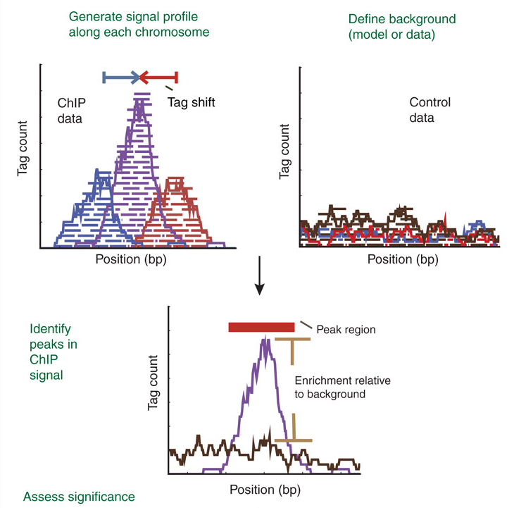
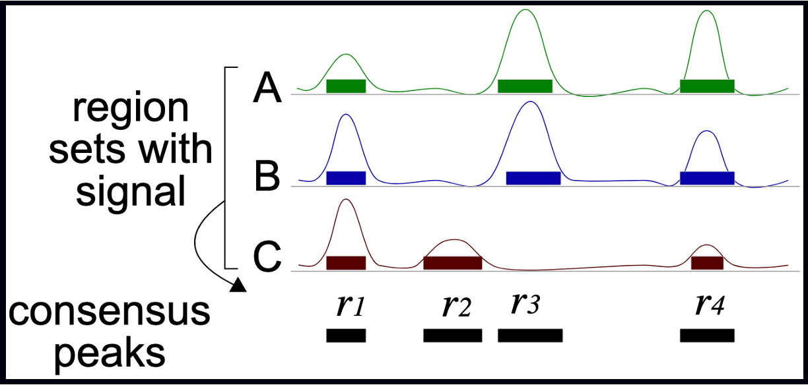
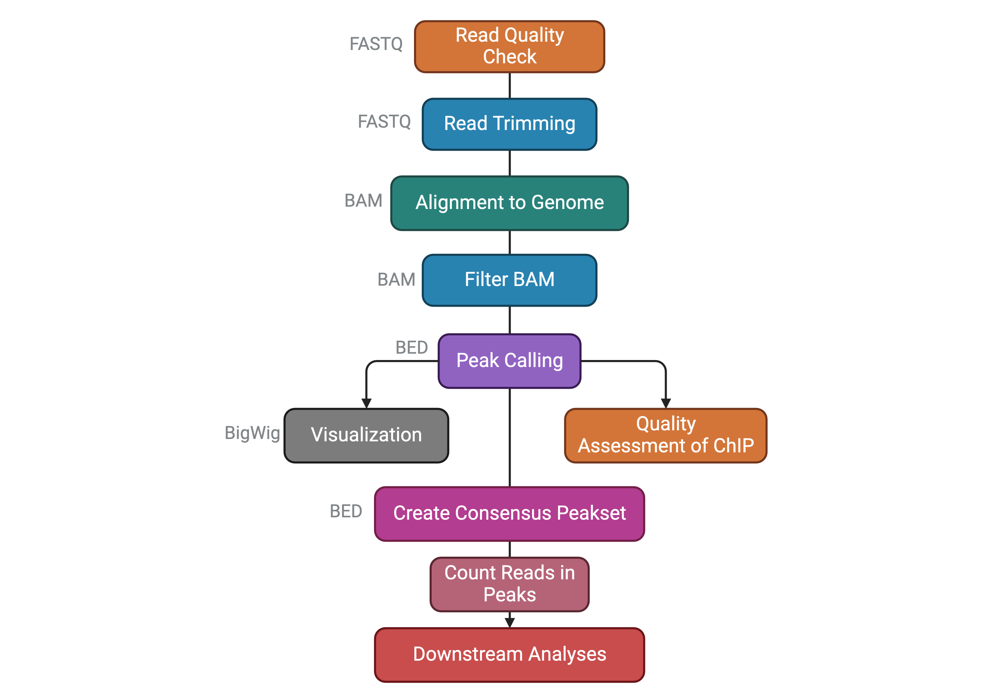

```{r setup, include=FALSE}
library(kableExtra)
knitr::opts_chunk$set(engine = 'R', echo = TRUE, fig.align = 'center', warning = FALSE, message = FALSE, class.output = ".bordered")
```

## The ChIP-seq technology

In this context, we chose to deal with a Chromatin Immuno-precipitation (ChIP from now on) assay. 

> 💭 Suppose you have found an interesting, new histone variant, and managed to produce a strong antibody against it. You want to know where it's located in the genome of your cells of interest (say, tumor cells), to start deducing its function.

ChIP, coupled to sequencing (ChIP-seq), allows you to approach the question, **genome-wide**.

It works by extracting chromatin (DNA bound to protein), fragmenting it, and selecting the protein or protein variant of interest from this complex mixture with an antibody in some way specific for it. The **subset of genome you will have isolated** will constitute the sequences you expect your variant to bind, **informing your inferences regarding its function**.

> ChIP-seq use in mapping histone modifications has been seminal in epigenetics research! ([Ku et al., 2011](https://pubmed.ncbi.nlm.nih.gov/21825079/))

Here you can see a recap of the major steps:

```         
+ Cross-linking: add Formaldehyde
+ Cell lysis (breakdown of cell membranes)
+ Fragmentation of DNA fragments (shearing), e.g. digestion with specific endonuclease enzymes (dpn1) or sonication
+ Addition of specific bead-coupled antibody against the protein of interest, separating it from the mixture
+ Separate DNA from the protein (reverse cross-linking), and DNA purification
+ DNA fragment amplification, library construction
+ Library sequencing by NGS (essentially Illumina)
```

<center>

<div>


</div>

</center>

## Tips for designing a ChIP-seq experiment

Besides characterizing binding patterns in general, a common goal in ChIP-seq experiments is to **identify changes in protein binding patterns** between conditions, an application known as differential binding.

Effective analysis of ChIP-seq data requires sufficient coverage by sequence reads (**sequencing depth**). It mainly depends on the size of the genome, and the number and size of the binding sites of the protein.

-   For mammalian (or any species with a relatively large genome) transcription factors (TFs) and chromatin modifications such as enhancer-associated histone marks: **20 million reads** are adequate

-   Proteins with more binding sites (e.g., RNA Pol II) or more promiscuous factors (e.g. CTCF) need more reads, up to **60 million** for mammalian ChIP-seq

-   Sequencing depth rules of thumb: \>10M reads for *narrow* peaks, \>20M for *broad* peaks (you will understand better this concept later in the *Peak Calling section*)

Another consideration is about sequence modality: long & paired-end reads are useful, but not essential - they may however help in specific, high-precision binding site discovery. Most of the times, ChIP-seq can be performed in **single-end** mode.

About the number of **technical replicates**, unlike with RNA-Seq, more than two replicates do not significantly increase the number of identified peaks.

#### ChIP controls

A successful ChIP-seq experiment must have the appropriate **controls** to optimize signal-noise ratio. Well-made controls help **eliminate false positives**. In fact, there is always some signal on open chromatin. This may be due to multiple factors, but can be boiled down to three reasons: **A)** non-specific binding from the antibody can precipitate random sequences **B)** digestion, sonication, or any other method of shearing will introduce biases towards certain sequences **C)** different operators will perform the same protocol slightly differently, yielding higher or lower signal/noise ratios.

The following controls are often used to abate these biases:

-   An "**input**" DNA sample in which a library is generated from DNA that has been cross-linked and sonicated but not immuno-precipitated. It controls for the **bias introduced before even immunoprecipitating**, i.e. from sonication.

-   An **IgG** "mock"-ChIP, using an antibody that will not bind to nuclear proteins and should generate random immuno-precipitated DNA. It controls for **non-specific sequences** that precipitate alongside the target protein, but are not bound by it.

-   A **Spike-In** can also be introduced, using different genomes (e.g. Drosophila in a Human experiment) to control for handling **variability** between users, or batch differences between reagents. This helps dampen these confounders.

> **Input DNA control is ideal** in most of the cases. Indeed, one problem with IgG control is that if too little DNA is recovered after immuno-precipitation, sequencing library will be of low complexity and binding sites identified using this control could be biased. Read [this biostars post](https://www.biostars.org/p/15817/) for discussion.

## Next Generation Sequencing

NGS technologies (Illumina/PacBio/Ultima/BGI) allow the processing of millions of synthesis reactions **in parallel**, resulting in high throughput, higher sensitivity, speed and reduced cost compared to first generation sequencing technologies (e.g., Sanger method).

> Given the vast amounts of quantitative sequencing data generated, NGS-based methods rely on resource-intensive **data processing pipelines** to analyze data.

In addition to the sequence itself, and unlike Sanger sequencing, the high-throughput nature of NGS provides **quantitative** information (depth of coverage) due to the high level of sequence redundancy at a locus.

There are short-read and long-read NSG approaches. Short reads of NGS range in size **from 75 to 300 bp** depending on the application and sequencing chemistry. NGS is taken to mean second generation technologies, however 3G and 4G technologies have since evolved (enable longer read sequences in excess of **10 kilobases**).

Among 2G NGS chemistries, Illumina **sequencing by synthesis** (SBS) is the most widely adopted worldwide, responsible for generating more than 90% of the world's sequencing data.

<center>

<div>


</div>


## The basics of ChIP-seq data processing

### Raw Sequencing Output

The **raw output** of any sequencing run consists of a series of sequences (called *tags* or ***reads***). These sequences can have varying length based on the run parameters set on the sequencing platform. Nevertheless, **they are made available for humans to read under a standardized file format known as FASTQ**. This is the universally accepted format used to encode sequences after sequencing. An example of real FASTQ file with only two ***reads*** is provided below.

```{r eval=FALSE}
@Seq1
AGTCAGTTAAGCTGGTCCGTAGCTCTGAGGCTGACGAGTCGAGCTCGTACG
+
BBBEGGGGEGGGFGFGGEFGFGFGGFGGGGGGFGFGFGGGFGFGFGFGFG
@Seq2
TGCTAAGCTAGCTAGCTAGCTAGCTAGCTAGCTAGCTAGCTAGCTAGC
+
EEEEEEEEEEEEEEEEEEEEEEEEEEEEEEEEEEEEEEEEEEEEEE
```

**FASTQ files are an intermediate file in the analysis** and are used to assess quality metrics for any given sequence. The **quality of each base call** is encoded in the line after the `+` following the standard [**Phred score**](https://en.wikipedia.org/wiki/Phred_quality_score) system.

> 💡 **Since we now have an initial metric for each sequence, it is mandatory to conduct some standard quality control evaluation of our sequences to eventually spot technical defects in the sequencing run early on in the analysis.**

### Quality metrics inspection

Computational tools like [FastQC](https://www.bioinformatics.babraham.ac.uk/projects/fastqc/) aid with the **visual inspection of per-sample quality metrics** from NGS experiments. Some of the QC metrics of interest to consider include the ones listed below, on the **left** are optimal metric profiles while on the **right** are sub-optimal ones:

**Per-base Sequence Quality**: This uses **box plots** to highlight the per-base quality along all **reads in the sequencing experiment, we can notice a physiological drop in quality towards the end part of the read**.

**Per-sequence Quality Scores**: Here we are plotting the **distribution of Phred scores** across all identified sequences, we can see that the high quality experiment (left) has a peak at higher Phred scores values (34-38).

**Per-base Sequence Content**:  Here we check the sequence (read) base content, in a normal scenario we do not expect any dramatic variation across the full length of the read since we should see a quasi-balanced distribution of bases.

**Per-sequence GC Content**:  GC-content refers to the **degree at which guanosine and cytosine are present within a sequence**, in NGS experiments which also include PCR amplification this aspect is crucial to check since GC-poor sequences may be enriched due to their easier **amplification bias**. In a normal random library we would expect this to have a bell-shaped distribution such as the one on the left.

**Sequence Duplication Levels**: This plot shows the degree of sequence duplication levels. In a normal library (left) we **expect to have low levels of duplication** which can be a positive indicator of high sequencing coverage.

**Adapter Content**:  In NGS experiments we use **adapters** to create a library. Sometimes these can get sequenced accidentally and end up being part of a **read**. This phenomenon can be spotted here and corrected using a computational approach called **adapter trimming**.


### Trimming

The **read trimming** step consists of removing a variable portion of read extremities that contain adapters/have suboptimal quality indicated by the Phred score. Tools like `Cutadapt` can be used to perform this task after read QC, and FASTQC can be eventually run just after read trimming to double-check positive effect of getting rid of bad sequences. Note that after this step, reads might have different lengths.

### Read alignment

Now that we have assessed the quality of the sequencing data, we are ready to align the reads to the **reference genome** in order to **map the exact chromosomal** location they derive from.

> A reference genome is a set of nucleic acid sequences assembled as a representative example of a species' genetic material. It does not accurately represent the set of genes of any single organism, but a *mosaic* of different nucleic acid sequences from each individual. For each model organism, **several possible reference genomes may be available** (e.g. hg19 and hg38 for human).
>
> As the cost of DNA sequencing falls, and new full genome sequencing technologies emerge, more genome sequences continue to be generated. New alignments are built and the reference genomes improved (fewer gaps, fixed misrepresentations in the sequence, etc). The different reference genomes correspond to the different released versions (called "**builds**").

A mapper tool takes as input a reference genome and a set of reads. Its aim is to **match each read sequence with the reference genome sequence**, allowing mismatches, indels and clipping of some short fragments on the two ends of the reads.

<center>
**Illustration of the mapping process** 


</center>


Among the different mappers, `Bowtie2` is a fast and open-source aligner particularly good at aligning sequencing reads of about 50 up to 1,000s of bases to relatively long genomes.

Bowtie2 can identify reads that are:

1.  **uniquely mapped**: read pairs aligned exactly 1 time

2.  **multi-mapped**: reads pairs aligned more than 1 time

3.  **unmapped**: read pairs non concordantly aligned or not aligned at all

> Multi-mapped reads can happen because of repetition in the reference genome (e.g. multiple copies of a gene), particularly when reads are small. It is difficult to decide where these sequences come from and therefore **most of the pipelines ignore them**.

#### Mapping statistics

Checking the mapping statistics is an important step to perform before to continue any analyses. There are several potential **sources for errors in mapping**, including (but not limited to):

-   PCR artifacts: PCR errors will show as mismatches in the alignment

-   sequencing errors

-   error of the mapping algorithm due to repetitive regions or other low-complexity regions.

A **low percentage of uniquely mapped reads** is often due to (i) either excessive amplification in the PCR step, (ii) inadequate read length, or (iii) problems with the sequencing platform.

> **70% or higher** is considered a good percentage of uniquely mapped reads over all the reads, whereas 50% or lower is concerning. The percentages are not consistent across different organisms, thus the rule can be flexible!

But where the read mappings are stored?

#### The BAM file format

A BAM (Binary Alignment Map) file is a *compressed binary file* storing the read sequences, whether they have been aligned to a reference sequence (e.g., a chromosome), and if so, the position on the reference sequence at which they have been aligned.

A BAM file (or a SAM file, the non-compressed version) consists of:

-   A **header section** (the lines starting with \@) containing *metadata*, particularly the chromosome names and lengths (lines starting with the @SQ symbol)

-   An **alignment section** consisting of a table with 11 mandatory fields, as well as a variable number of optional fields.

<center>**BAM file format** </center>

Questions:

```{r}
#| code-fold: true
#| code-summary: "Which information do you find in a BAM file that you also find in the FASTQ file?"

# Sequences and quality information
```

```{r}
#| code-fold: true
#| code-summary: "What is the additional information compared to the FASTQ file?"

# Mapping information, Location of the read on the chromosome, Mapping quality, etc
```

### Peak calling

The read count data generated by ChIP-seq is massive. In order to predict *the actual sites where the protein of interest is likely to bind*, different peak calling methods have been developed. **Peaks** are regions with **significant number of mapped reads that produce a *pileup***.

> ChIP-seq is most often performed with **single-end reads**, and ChIP fragments are sequenced from their 5' ends only. This creates **two distinct peaks of read density**! One on each strand with the binding site falling in the middle of these peaks. The distance from the middle of the peaks to the binding site is often referred to as the "*shift*".

<center>


*Forward (blue) and reverse (maroon) Read Density Profiles derived from the read data contribute to the Combined Density Profile (orange). [Nat. Methods,2008](https://pubmed.ncbi.nlm.nih.gov/19160518/)*

</center>

The most popular tool to find peaks is **MACS2** which empirically models the **shift size** of ChIP-Seq reads, and uses it to improve the spatial resolution of predicted binding sites. Briefly, these are **the steps** performed by MACS:

1.  removing duplicate reads

2.  modelling the shift size

3.  scaling the libraries with respect to their controls

4.  performing peak detection

5.  estimating False Discovery Rate (FDR)

The peak detection identifies areas in the genome that have been **enriched** **with mapped reads**.

> Enrichment = Immunoprecipitation reads/background reads (mock IP or untagged IP).
>
> If an experimental control data is NOT available, a *random genomic background* is assumed.

<center>

{width="421"}

</center>

Finally, peaks are filtered to reduce *false positives* and ranked according to relative strength or statistical significance.

#### Different peak profiles

An important factor that influences the sequencing depth that is required for a ChIP--seq experiment is whether the protein (or chromatin modification) is a point-source factor, a broad-source factor or a mixed-source factor.

-   **Point sources** occur at specific locations in the genome. This class includes sequence-specific transcription factors as well as some highly localized chromatin marks, for example, those associated with enhancers and transcription start sites. They will generate more often ***narrow*** **peaks**.

-   **Broad sources** are generally those that cover extended areas of the genome, such as many chromatin marks (for example, histone H3 lysine 9 trimethylation (H3K9me3) marks). They will give raise to **broad peaks**.

-   **Mixed-source factors**, such as RNA polymerase II, yield both types of peaks. As expected, broad-source and mixed-source factors require a greater number of reads than point-source factors. Peaks generated will have a **mixed profile between narrow and broad**.

<center></center>

#### Additional QC metrics

After peak calling, it's important to check some metrics that are indicative of the overall quality of the ChIP-seq experiment. Here are two of the most useful:

-   *FRiP score*: reports the percentage of reads overlapping within called peak. Can be useful to understand how much the IP sample is "enriched".

-   *Strand cross-correlation*: high-quality ChIP-seq produces significant clustering of enriched reads at locations bound by the protein of interest, that present as a bimodal density profile on the forward and reverse strands (peaks). The cross-correlation metric calculates how many bases to shift the bimodal peaks in order to get the maximum correlation between the two read clusters, which corresponds to the *predominant **fragment length***.

#### BigWig and BED file formats

Most high-throughput data can be viewed as a ***continuous*** **score** over the bases of the genome. In case of RNA-seq or ChIP-seq experiments, the data can be represented as **read coverage values per genomic base position**.

This sort of data can be stored as a generic text file or can have special formats such as Wig (stands for wiggle) from UCSC, or the **bigWig format**, which is an indexed binary format of the wig files.

> The bigWig format is great for data that covers a large fraction of the genome with varying and continuous scores, because the file is much smaller than regular text files that have the same information and it can be queried more easily since **it is indexed**. Most of the ENCODE project data can be downloaded in bigWig format!

If we want to know instead the peak locations in the genome as **chromosome coordinates with well defined *start* and *end* positions**, we want to look at BED files, that are the main output of the peak calling step.

A typical BED file is a text file format used to store genomic regions as coordinates. The data are presented in the form of columns separated by *tabs*. The first three required BED fields are: "chrom", "chromStart", and "chromEnd". There are 9 additional optional BED fields. You cna find more details in the UCSC webpage [here](https://genome.ucsc.edu/FAQ/FAQformat.html#format1).


> We will use this file type to inspect peak locations and for future downstream analyses!

### Collapse data into a single dataset

Imagine that you are performing these steps of read processing not just for one library, but for a collection of samples *with different replicates and experimental conditions*, and you subsequently want to make differential comparisons across conditions. To this aim, it's necessary to collapse the single peak files obtained from each single library into a single ***consensus*** **peakset**.

In this step you can also add a filtering to exclude genomic intervals that are identified as peaks only in a minority of samples. `DiffBind` and `BEDTools` are two common programs that can handle this task.

<center>

{width="400"}

[Source](https://databio.org/slides/downstream_atac_analysis.html#/acknowledgements)

</center>


It can be helpful to make a plot of how many peaks overlap in how many samples, like this one:

<center>


*This plot shows that there are almost 4000 total merged peaks, representing the union of all intervals. At the other extreme, there are around 100 peaks that overlap in all 11 samples, representing the intersection of all the samples.*

</center>

> Which should we chose? Given the rigor of the statistical analysis that we are going to perform, now we can choose a more *inclusive* consensus set. The default is to make a consensus peakset using peaks identified **in at least 2 samples**.

### Counting reads in consensus peaks

Once consensus genomic regions are defined, the next step is to **count the number of sequencing reads that align to these regions**. This read counting process provides **quantitative information** about the strength and extent of protein binding within the identified peaks.

> Uniquely mapped reads can be counted within peaks in the consensus using a tool called `FeatureCounts`.

Sample counts for all the consensus peaks are output as a tabular file, in which **each row represents one peak**, and you have **one column for each sample**. We will now load one and take a closer look: this will be our starting point in the *hands-on* analysis of a ChIP-seq dataset.

> Before going on, let's summarize the steps of a ChIP-seq analysis workflow that we have seen so far with the following scheme. You can find the file format names associated to the output of each task.

<center>{width="647"}</center>