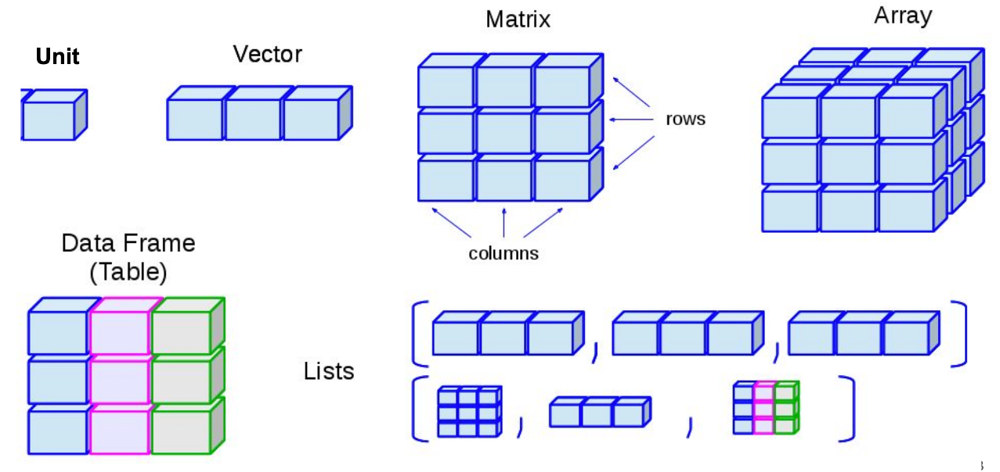
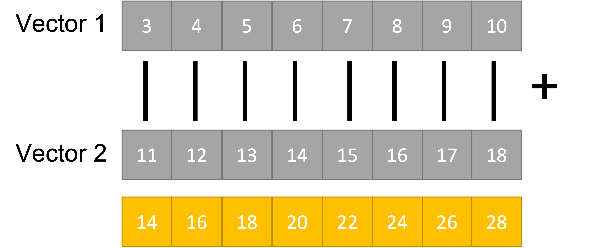
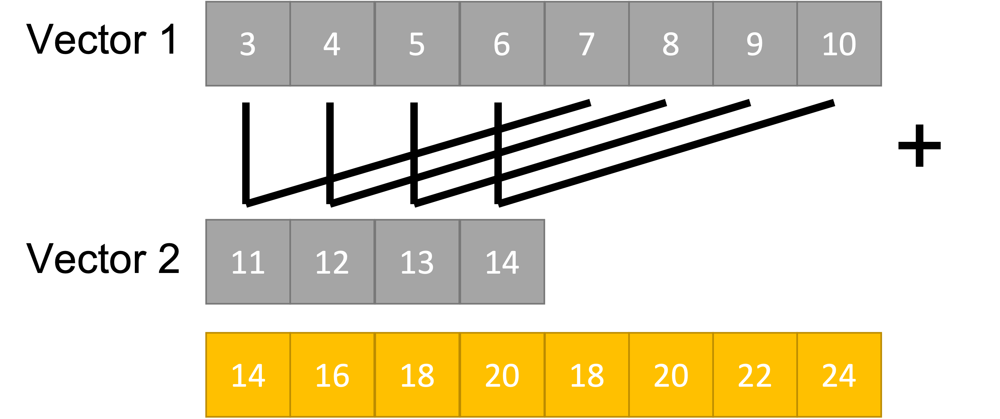
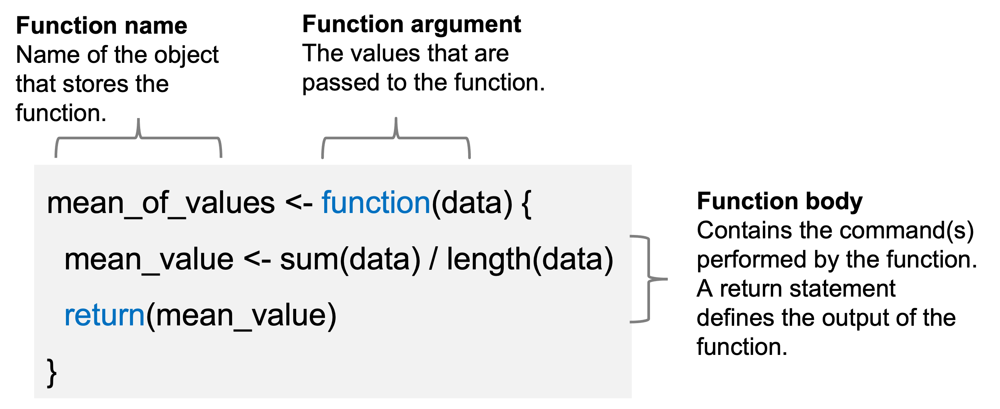
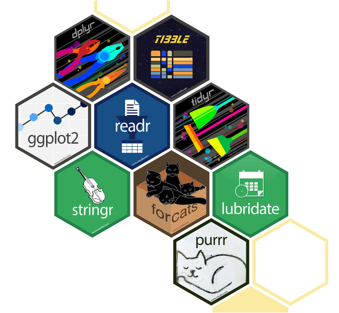
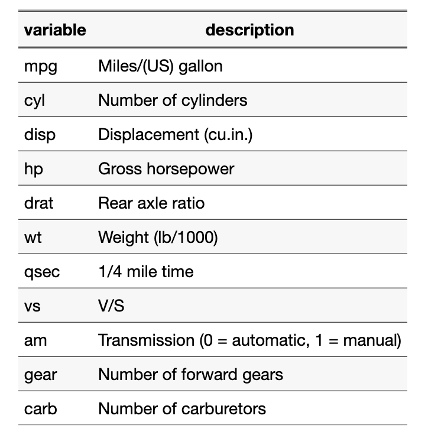
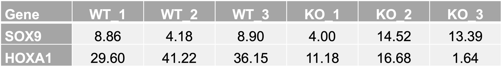
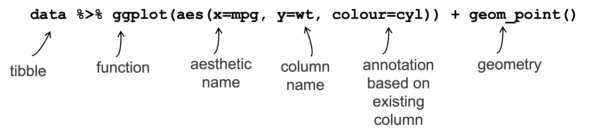
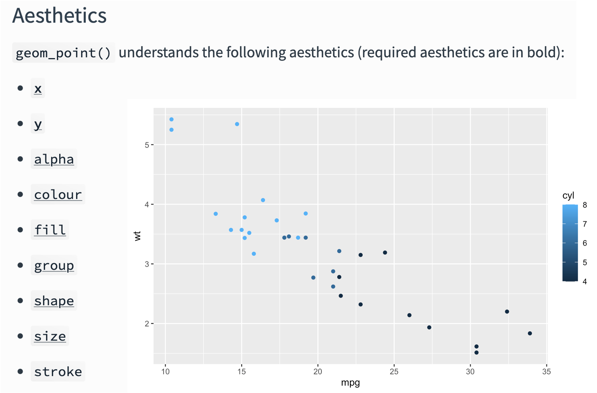
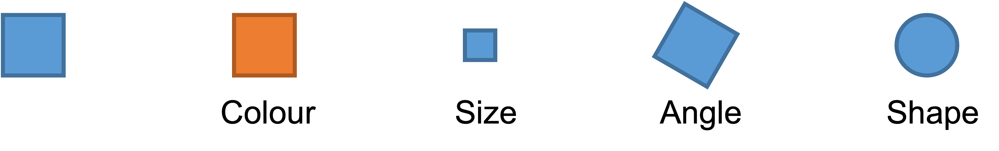

```{r setup, include=FALSE}
library(kableExtra)
knitr::opts_chunk$set(
	echo = TRUE,
	fig.align = "center",
	message = FALSE,
	warning = FALSE,
	class.output = ".bordered",
	engine = "R"
)
```

```{=html}
<style>
div.col pre { background-color:lightpink; }
div.col pre.r { background-color:white; }
</style>
```

## Objectives

-   Introduction to R and RStudio
-   Setting up the R environment
-   Working with R objects
-   Install, and use R packages and functions
-   Analysis of genomic data using GRanges

## *Omics* experiments

'Omics' as disciplines **work to** **answer questions** regarding specific 'omes'.
These questions are enabled by omics experiments; in most cases, these will be **sequencing- or mass-spectrometry based**.

The identification of a suitable model, types and numbers of samples, the process of extraction and purification of our target 'ome', and finally its reformulation into a sequenceable product, i.e. **a *library***, **shape the final bioinformatic dataset** and **place limits on the possible questions** we will be able to ask of it.

> For example, in the case of RNA-seq, phenol-based extraction and precipitation will yield results that are not always comparable with total RNA extraction with a spin column.
> Even more, the contingent decision to perform ribodepletion or enrichment for polyadenylated transcript will have an impact even on simple gene expression analyses.

Summing up, an Omics experiment is designed starting from a question, selecting the sample(s), wet lab procedure and library preparations that will enable the most truthful, informative dataset to be built.

<center>


</center>

## Why learn R?

R is a programming language built for statistical computing, data exploration, and graphical representation.
Developed by Ross Ihaka and Robert Gentleman in the early 1990s, it has grown to be widely adopted in academia, research, and various data-focused industries.

<center>

{width="400"}

</center>

Key features and advantages of R:

-   Statistical analysis
-   Data Exploration and Visualization
-   Vibrant community of scientists, developers, users
-   Extensive Package Ecosystem
-   Reproducible Research
-   Integration with Other Languages
-   Learning Resources and Documentation

## Setting up Rstudio

First of all, let's start assembling the tools that you will need for this workshop!
While R by itself has no particular user interface, RStudio is the tool that allows you to click and actually 'see' what you are doing.
RStudio is an *integrated development environment* (IDE) and will be our primary tool to interact with R.

You can follow two strategies:

1.  Install `R` and RStudio on your machine
2.  Run RStudio in a browser using RStudio Cloud.

Note that the first option will require a bit more time and effort.
To get started with RStudio Cloud (now Posit Cloud), click on [this link](https://posit.cloud/plans/free) and create a Posit free account.
Once you completed your registration, you are redirected to `Your Workspace`.
To start a new R project, you can click on `New Project > New RStudio Project`.
This will open RStudio on the Cloud.

## The RStudio Interface

Now that you have RStudio open, you should see something similar to this:

<center></center>

The RStudio interface is composed of *quadrants*:

1.  The `Console` window: located in the bottom-left, it's where you will find the output of your coding, and it's also possible to type `R` code *interactively* on the console.

2.  The `Files / Plots / Packages / Help / Viewer` window: located in the bottom-right, it displays your **current file system**, which is pointed to the position where your `Rproject` you just created lives.

    -   The *Files* pane lists the files and folders in your **root directory** (i.e. where by default RStudio saves your analyses).

    -   Another important pane is *Plots*, designed to show you any plots you have created.

    -   The *Package* pane instead allows to manage all the **additional tools** you can import and use when you perform your analyses.
        They are useful to enhance the basic R functions from different aspects.

    -   If you need H E L P, you can use the *Help* pane: you can search for specific topics, for instance how a computation works and other kinds of documentation.

3.  The `Environment / History / Connections / Tutorial` window: you can find it in the top right position.

    -   It is pointed to the *Environment* pane, that is a place where you can find all the *objects* available for computation (e.g. datasets, plots, lists, etc.).

    -   The *History* pane keeps whatever computation you run in the console.
        You can re-run the computation stored in the history (double click or copy-paste) and you can also copy the past code into an existing or new *R Script*.


## R fundamentals

### Basic computations

The most basic computation you can do in *R* is **arithmetic operations**.
Let's take a look at the following examples:

```{r}
# Addition
14 + 7

# Division
14 / 7

# Square root
sqrt(14)
```

But R is much more than an enormous calculator!
Besides arithmetic operations, there are also **logical queries** you can perform.
Logical queries always return either the value `TRUE` or `FALSE`.

```{r}
#1 Is it TRUE or FALSE?
3 == 3

#2 Is 45 bigger than 55?
50 > 56

#3 Are these two words NOT the same?
"Gene" != "gene"
```

> Notice that in logical queries, `equal to` is represented by `==` and not by `=` , which instead is used to assign a value to an object.
> However, in practice, most *R* programmers tend to avoid `=` since it can easily lead to confusion with `==`.

Below is a list of logical operators commonly used in R

<center></center>


### Assigning values to objects

Assigning values to objects with `<-` is a common task.
What can be an *object* ?

-   a list of names
-   a series of number
-   a dataset
-   a plot
-   a function
-   etc.

In short, an object can enclose different things which form part of your data analysis.
For example, objects are useful to **store results** that you want to process further in later steps of the analysis.
We have to use the assign operator `<-` to assign a value to an object.
Let's have a look at an example:

```{r}
# Let's assign the gene "TP53" to the "genes" object
genes <- "TP53"
```

Now the object `genes` carries the value `"TP53"`.
If you check out the *Environment* pane, you should see that the `gene` object appeared there.
We can also **print values** of an object in the console by simply typing the name of the object `genes` and hit `Return ↵`.

```{r}
# What are my genes?
genes
```

To create **objects with multiple values**, we can use the function `c()` which stands for 'concatenate':

```{r}
# Adding some more genes to the object
genes <- c("TP53",
           "TNF",
           "EGFR",
           "VEGFA",
           "APOE",
           "IL6")
           
# Here are my genes
genes
```

To concatenate values into a single object, we need to use a comma `,` to separate each value.
Otherwise, *R* will report an error back.

```{r error = TRUE, include=TRUE, eval=FALSE}
genes <- c("TP53" "TNF")
```

Don't worry about it!
R's error messages tend to be very useful and give meaningful clues to what went wrong.
In this case, we can see that something 'unexpected' happened and it shows where our mistake is.

Storing numerical data in variables

```{r}

20 -> x

y <- 5

x + y

```

Rules and guidelines in naming variables

-   Made up of letters, numbers, dots, underscores
-   Cannot begin with a number or underscore
-   Use informative names where possible
-   Opt for lower case
-   Separate words with dots of underscores

```{r, error=TRUE, include=TRUE}
_x <- 2
```


## Object types (Data Structures)

<center>{width="500"}</center>

### Vectors

The most basic unit in R.
They contain sets of values of the **same data type**:

-   Numeric
-   Integer
-   Character (text)
-   Logical (TRUE or FALSE)

The object `genes` we created before is a character vector.

Can you tell the difference in the elements of the following vectors?

```{r}
x <- c(1 ,2, 3)
x

y <- c(1,2,4,"hello")
y
```

> What happens if you mix data types inside a vector?
> R generates a resulting vector with a mode that best fits all its elements.
> The process of converting between different storage modes is known as "coercion".

Useful functions for creating vectors:

-   rep: replicate elements of vectors and lists
-   seq: sequence generation
-   statistical distributions (e.g. rnorm, rpois etc)

```{r}
rep(c("hello", "ciao"), times=2)

rep(c("hello", "ciao"), each=2)

?rep
```

```{r}
seq(from=2, to=10, by=2)
```

In **vectorised operations** equivalent positions are matched and shorter vectors are recycled.

```{r}
# Operation to a single element
c(1,2,3) * 2

# Operation between two vectors 
c(1,2,3) + c(4,5,6)

# Shorter vector is recycled
c(1,2,3) + c(4,5)

```

<center>

{width="400"}

Shorter vector is recycled

{width="400"}

</center>

### Lists

Values inside objects are meant to be of the same *type*, for instance *numeric* or *character*.
Consequently, mixing different types of data into one object is likely a bad idea.
However, there is an exception: a *list* object can hold other objects of different data types, e.g. it represents **a collection of vectors**.

Lists are highly useful within functions in R.
We can combine various types of results into a single list to return them together.

Elements of a list can be named (`names` attribute).

```{r}
data <- list(genes = genes,
             counts = c(1, 2, 3, 4),
             metadata = c("TGFB1", 5, "AKT1", 6))
data
```

> You will notice in this example that we do not use `""` for each value in the list.
> This is because `genes` is not a `character` value, but an object.
> When we refer to objects, we **do not need quotation marks**.

Looking at the list item in the environment page, you can see that the object `data` is classified as a `List of 3,` and if you click on the blue icon, you can inspect the different objects inside.

<center>{width="500"}</center>

Elements are indexed by double brackets but they can also be referenced by the \$ notation when named.

```{r}
# Retrieve 
data$genes
data[[2]]
data[1]
```

### Data frames

The *data.frame* structure is one of the most abundantly used in `R`.
Think of data.frames as the R equivalent of Excel spreadsheets, so a way to store tabular data.
As we will see later, pretty much all the data we are going to handle will be in the form of a data.frame or some of its other variations.

```{r}
# Let's create and display a data frame (a table) with four rows and two columns
df <- data.frame("Class"=c("a","b","c","d"), # First column
            "Quantity"=c(1,10,4,6)) # Second column
df
```

We have instructed R to create a data.frame object.
We will give more of these commands from now on!

### Object Attributes

Objects have attributes that we can retrieve with psecialized functions:

-   class
-   length
-   dim
-   names
-   attributes

How can we check what kind ("class") of object we have?

```{r}
class(genes)
class(data)
```

```{r}
names(data)
```

### Functions

We mention the term '*function*' multiple times, but what are functions and why we need them?
In simple terms, **functions are objects** that contain lines of codes and can be seen as shortcuts for our programming.
Functions are useful for repeating several operations across multiple datasets with a single command.
They save space and time, making our code more readable and reliable.
We will make an example to understand better, by calculating the arithmetic mean:

```{r}
# We create an object that stores our values
values <- c(1, 5, 7, 4, 13, 2, 9, 5)

# Manually compute the sum 
sum <- 1 + 5 + 7 + 4 + 13 + 2 + 9 + 5

# Divide the sum by the number of values
mean <- sum / 8
mean
```

Or...

```{r}
# Use the mean function that is part of the R base package
mean(values)
```

```{r}
# Let's check that the two methods coincide
sum / 8 == mean(values)
```

Let's define the function for the above example

```{r}

mean_of_values <- function(data) {
  
  mean_value <- sum(data) / length(data)
  return(mean_value)
}

mean_of_values(values)

```

<center>{width="500"}</center>

> Make your own function!
> If the formula to convert Fahrenheit to Celsius is as follows, how can you define a function?
> (32°F − 32) × 5/9 = 0°C

```{r, include=FALSE}
# We define fahrenheit_to_celsius by assigning it to the output of function. The list of argument names are contained within parentheses. Next, the body of the function–the statements that are executed when it runs–is contained within curly braces ({}). The statements in the body are indented by two spaces, which makes the code easier to read but does not affect how the code operates.

# When we call the function, the values we pass to it are assigned to those variables so that we can use them inside the function. Inside the function, we use a return statement to send a result back to whoever asked for it.

# In R, it is not necessary to include the return statement. R automatically returns whichever variable is on the last line of the body of the function. While in the learning phase, we will explicitly define the return statement.

fahrenheit_to_celsius <- function(temp_F) {
  temp_C <- (temp_F - 32) * 5 / 9
  return(temp_C)
}
```

> 💡We can also nest one function call inside another.

## Useful functions in R

Looking up help

```{r}
?sqrt
```

```{r}
??sqrt
```

Get and Set working directory in R

```{r}
# Show the current directory
getwd()

# Set the working directory
#setwd('Users/<user>/')

```

```{r}
# Inspect the R environment 
ls()
```

```{r}
# Inspect files in the currect directory
length(list.files())
list.files()
#dir()

# Verify that a file is in a directory
list.files('../results/')
'counts_table.csv' %in% list.files('../results/')

```

## Tidyverse

A collection of R packages designed for data science.
It aims to overcome many structural challenges when working in R by adopting a unified design and data philosophy.
The tools are designed to work together but can seamlessly integrated with the broader R ecosystem.

<center>{width="400"}</center>

Tibble - data storage

ReadR - reading data from files

DplyR - Manipulate and filter data

TidyR - Model data correctly

Ggplot2 - Draw figures and graphs

Tidy data describes a standard way of storing data that is used wherever possible throughout the tidyverse.

-   Each variable is a column; each column is a variable.
-   Each observation is a row; each row is an observation.
-   Each value is a cell; each cell is a single value.

```{r}
# Check if tidyverse is not already installed and installs it if the argument returns TRUE
if (!require("tidyverse", quietly = TRUE))
  install.packages("tidyverse")

library(tidyverse)
```

The default installation of R includes a variety of built-in datasets, typically used as sample data for experimenting with R functions.
We will explore the main functions of `dplyr` and `ggplot2` using the mtcars dataset.

mtcars: Motor Trend Car Road Tests

### Load a built-in R data

```{r}
# Check the list of built-in datasets
#data()

# Load the mtcars dataset
data(mtcars)
head(mtcars, 4)
```

Let's have a look at the dataset.
What attributes mtcars has?

```{r}
# Check the attributes of an object
attributes(mtcars)
```

What do the hearders refer to?

The data was extracted from the 1974 Motor Trend US magazine, and comprises fuel consumption and 10 aspects of automobile design and performance for 32 automobiles (1973–74 models).

<center>{width="400"}</center>

mpg - Miles per Gallon cyl - \# of cylinders disp - displacement, in cubic inches hp - horsepower drat - driveshaft ratio wt - weight qsec - 1/4 mile time; a measure of acceleration vs - 'V' or straight - engine shape am - transmission; auto=0 or manual=1 gear - \# of gears carb - \# of carburetors.

### dplyr

`dplyr` comes with many useful functions to manipulate your data.
Each function accepts a dataframe/tibble as its first argument and returns a modified dataframe/tibble.
It also allows for multiple functions to run together by chaining the operations.
This way we can avoid repetive coding and intermediate variables.

input --\> selection --\> filter --\> mutate --\> output

The **pipe operator %\>%** to the rescue!

input %\>% selection %\>% filter %\>% mutate

Filtering and subsetting

```{r}
# Select specific columns
mtcars %>% select(mpg, cyl) %>% head(2)
mtcars %>% select(1, 2) %>% head(2)
mtcars %>% select(-mpg, -cyl) %>% head(2)
```

```{r}
# Select rows
mtcars %>% slice(2:4)
```

```{r}
# Filter a variable
mtcars %>% filter(mpg>21 & hp>90)
```

Let’s create a new variable to identify cars with miles per gallon (mpg) \> 25

```{r}
# Create a new variable
mtcars %>% mutate(highmpg = ifelse(mpg>25, '1', '0')) %>% filter(highmpg==1)
```

Combining operations: Identify cars with 5 gears and horse power \> 100.
Display the miles per gallon in descending order.

Note, we do not create a new object here, just inspecting the output of the combined functions we perform. 
```{r}
# Combining operations
mtcars %>% 
      mutate(hmpg_gear = ifelse(hp>100 & gear==5, '1', '0')) %>% 
      filter(hmpg_gear==1) %>%
      arrange(desc(mpg)) %>%
      select(mpg)

```

Transforming data: Long versus Wide Format

*Wide Format*

-   Compact and easy to read
-   Not extensible to more metadata

<center>{width="500"}</center>


*Long Format*

-   More verbose (repeated values)
-   All values in a single column
-   Amenable to more metadata
-   Useful for plotting

<center>{width="400"}</center>

We use `pivot_longer()`, which "lengthens" data, increasing the number of rows and decreasing the number of columns. The inverse transformation is `pivot_wider()`.

We will convert a subset (`slice` and `select`) of the mtcars object from wide to long format. We specify which columns we want to pivot into longer format in the `cols` argument. This information will be stored in the metadata column `names_to`. The actual values will be stored in the `values_to` column. `cols` defines a selection of columns. If empty, all variables are selected. You can supply bare variable names, select all variables between x and z with x:z, exclude y with -y.

We keep the rownames as a separate column.

```{r}
# Convert from wide to long format
mtcars %>% slice(1:4) %>% select(1:4) %>% 
  mutate(cars=rownames(.)) %>% 
  #pivot_longer(!cars, names_to = "keys", values_to = "value")
  pivot_longer(cols=mpg:hp, names_to = "keys", values_to = "value")
  
```

We first covert from wide to long format (in this cases using gather which is no longer under active development). Then we convert back to wide format.

```{r}
# Convert from long back to wide format
mtcars %>% slice(1:4) %>% select(1:4) %>% 
  mutate(cars=rownames(.)) %>% 
  # Here we use gather
  gather(keys, value, -cars) %>%
  pivot_wider(names_from = "keys", 
              names_prefix = "var_",
              values_from = "value")
```

> Similar transformations can be achieved with the reshape::melt and reshape::dcast functions

### ggplot2

ggplot is a powerful and flexible library for tidyverse.
Data stored in a dataframe/tibble is passed to ggplot along with two main arguments: i) columns to be plotted, and ii) graphical representation to be displayed.
Additional customization is possible.

**Geometries and Aesthetics**

Geometries are **types of plot**:

-   `geom_point()` Point geometry, (x/y plots, stripcharts etc)
-   `geom_line()` Line graphs
-   `geom_bar()` Barplots
-   `geom_boxplot()` Box plots
-   `geom_histogram()` Histogram plots

Aesthetics provide options to change the appearance of data in a plot - Using fixed values or - Linking to a column in the dataset - called an *aesthetic mapping*

In ggplot2, the x and y mappings for data points are specified within the `aes()` function, either in the `ggplot()` function or in individual geom layers. The geom determines how the data points are represented graphically (e.g., as points, lines, etc.), but the x and y values themselves are mapped to the data.

<center>

{width="500"}

{width="500"}

{width="500"}

</center>


Here, we create a scatter plot for two variables in the mtcar dataset and we will annotate the data based on a third variable.
```{r, fig.width=4}
mtcars %>% ggplot(aes(mpg, wt, colour=cyl)) + geom_point()
```

> Notice that the *cyl* is depicted as continuous variable.
> We can change this behaviour and plot it as discrete variable by converting it to a factor.

```{r}
# Check the class of cyl and convert to factor by defining the levels of the factor
class(mtcars$cyl)
unique(mtcars$cyl)

mtcars %>% mutate(cyl = factor(cyl, levels=unique(cyl)) ) %>% pull(cyl) %>% class()

#mtcars %>% mutate(across(cyl, as.factor)) %>% pull(cyl) %>% class()

```

```{r, fig.width=4}
mtcars %>% mutate(across(cyl, as.factor)) %>% 
        ggplot(aes(mpg, wt, colour=cyl)) + 
          geom_point()
```

Can you modify the code to annotate with car labels?

```{r, fig.width=8, include=TRUE}
mtcars %>% 
  mutate(across(cyl, as.factor),
          cars=rownames(.) ) %>% 
  ggplot(aes(mpg, wt, colour=cyl, label=cars)) + 
      geom_point() + 
      geom_text(vjust=1.6, hjust=0.4, size=2)
```

More exercises: 

- Make all data points size 4 and blue, with red stroke of size 2 and size 4.
- Size according to the number of gears

```{r, fig.width=6}
mtcars %>% ggplot(aes(mpg, wt )) + geom_point(size=4, colour='red', fill='blue', shape=21, stroke=2)
mtcars %>% mutate(across(gear, as.factor)) %>% ggplot(aes(mpg, wt, size=gear)) + geom_point(colour='red')
```

> Geometries warn when missing values have been dropped from the data set and not plotted.
> You can turn this off by setting na.rm = TRUE.

Plotting distributions - multiple density plots

Plot the miles per gallon density across different cylinder values

```{r, fig.width=4}
mtcars %>% mutate(across(cyl, as.factor)) %>% 
  ggplot(aes(mpg, fill=cyl, colour = cyl)) + 
  geom_density(alpha=0.4) + 
  theme_classic() +
  scale_fill_manual(values=c('grey','lightblue','yellow')) +
  theme(ggtitle("Miles per gallon density"),
        legend.position="bottom", 
        legend.text = element_text(size = 20), 
        legend.title = element_text(size = 15, face = 'bold'),
        axis.title.x = element_text(size = 16),
        axis.title.y = element_text(size = 16),
        axis.text.y=element_text(size = 10),
        axis.text.x=element_text(size = 10),
        legend.key.size = unit(.4, "cm")) +
  ylab('Density') +
  xlab('Miles per gallon')
```

> 💡 Perform Exploratory Data Analysis using the package `explore`.
> <https://cran.r-project.org/web/packages/explore/vignettes/explore-mtcars.html>

## Create an Rscript

You might want to save your code for a later use, especially when it starts to become long and complex.
In this case, it is not very convenient to write it in the console, which does not keep track of it (as far as you don't go back in the *History*) and does not allow to edit the code and save changes.

So, instead, we can write code into an **R Script**, which is a document that RStudio recognizes as *R programming code* and has `.R` as extension.
Files that are not R Scripts, like `.txt`, `.rtf` or `.md`, can also be opened in RStudio, but any code written in it will not be **automatically recognized**.

When opening an R script or creating a new one, it will display in the *Source* window.
The term 'source' can be understood as any type of file, e.g. data, programming code, notes, etc.

> Now let's create an R script, by selecting `File > New File > R Script` in the menu bar, or using the keyboard shortcut `Ctrl + Shift + N` on PC and `Cmd + Shift + N` on Mac.
> We will name it "Day1.R".
>
> Now you can go in the *History*, copy the lines previously coded (by clicking on the first line you want to copy, then pressing `Shift + Down arrow`, up to the last line of code) and then click `To Source`.
>
> ❗️ Writing some code in your *R script* will NOT automatically run it!
> If you tried pressing `Return ↵`, you would only add a new line.
> Instead, you need to select the code you want to run and press `Ctrl+Return ↵` (PC) or `Cmd+Return ↵` (Mac).

## References

- <https://r.qcbs.ca/workshop01/book-en/index.html> 
- <https://rstudio-education.github.io/hopr/>
- <https://www.bioinformatics.babraham.ac.uk/training.html>


