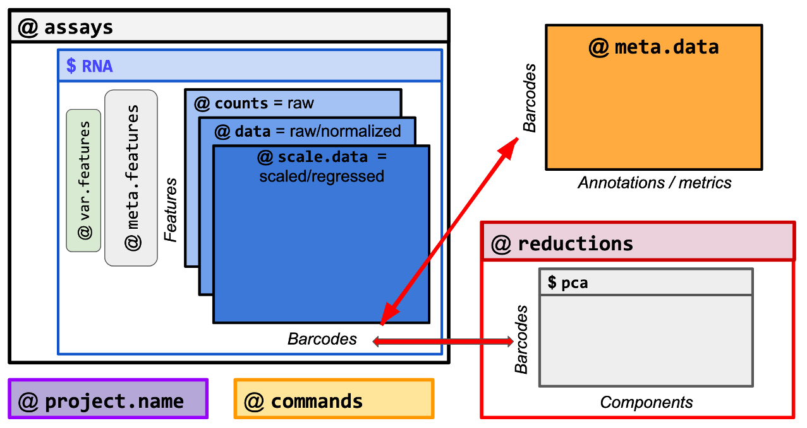

```{r setup, include=FALSE}
knitr::opts_chunk$set(
  tidy = TRUE,
  tidy.opts = list(width.cutoff = 95),
  message = FALSE,
  warning = FALSE,
  time_it = TRUE,
  error = TRUE,
  echo = TRUE,
  class.output = ".bordered",
  fig.align = 'center'
)
```


# Overview

This Tutorial aims to provide additional functions and exercises to accompany the Seurat - Guided Clustering Tutorial found [here](https://satijalab.org/seurat/articles/pbmc3k_tutorial).

Download the publicly available Peripheral Blood Mononuclear Cells (PBMC) dataset as shown below. Then we will follow the Seurat Tutorial for the main processing steps. Finally, we will switch to this tutorial to explore the structure of the Seurat object and additional functions for the analysis of single cell data. 

## Objectives

 * What is the structure of the Seurat Object?
 * Inspect different layers and metadata information
 * Add and tabulate metadata information  
 * Explore various visualization options for single cell data


```{r}
# Load libraries
library(dplyr)
library(Seurat)
library(patchwork)
library(ggplot2)
```


# Download the PBMC dataset from the 10X Genomics site

We start by downloading the Peripheral Blood Mononuclear Cells (PBMC) dataset and creating the Seurat object.

```{r download}

url <- 'https://cf.10xgenomics.com/samples/cell-exp/1.1.0/pbmc3k/pbmc3k_filtered_gene_bc_matrices.tar.gz'
file <- basename(url)
download.file(url, file)

untar(file, compressed = 'gzip', exdir = './' )

```

# Load the PBMC dataset and Create a Seurat Object

We concurrently perform selection and filtration of cells and genes based on quality metrics. The purpose is to remove low-quality cells damaged during the sequencing processing that can interfere with downstream analyses.

  * Features (genes) expressed in at least 3 cells
  * Cells with 200 or more features expressed

```{r init, }
# Load the PBMC dataset
pbmc.data <- Read10X(data.dir = "filtered_gene_bc_matrices/hg19/")
# Initialize the Seurat object with the raw (non-normalized data).
pbmc <- CreateSeuratObject(counts = pbmc.data, project = "pbmc3k", min.cells = 3, min.features = 200)
pbmc
```
```{r eval=FALSE}
## An object of class Seurat 
## 13714 features across 2700 samples within 1 assay 
## Active assay: RNA (13714 features, 0 variable features)
##  1 layer present: counts
```


**The PBMC dataset**

* Original files created by Cellranger:
  - genes.tsv: a tabular file with information about the 13714 genes in 2 columns (Ensembl gene id and the gene symbol) 
  - barcodes.tsv: a tabular file with the barcode for each of the 2,700 cells 
  - matrix.mtx: a condensed version of the count matrix

* Seurat Object:
  - Read counts for each gene (feature; row) in each cell (barcode; column)
  - 13714 features (genes) for 2,700 barcodes (cells)  
  - Sparse matrix with mostly zero values


***

# Processing workflow

Move back to the Seurat Tutorial [here](https://satijalab.org/seurat/articles/pbmc3k_tutorial) to run each of the steps below separately.


We run the main processing steps for single cell analysis: 

 * Data normalization and log transformation
 * Selection of variable features
 * Data scaling
 * Compute principal components
 * Create K-nearest neighbor (KNN) graph
 * Clustering of cells based on neighborhood graph
 * Compute UMAP to embed the neighborhood graph


```{r, echo=FALSE}

pbmc <- NormalizeData(pbmc)
pbmc <- FindVariableFeatures(pbmc, selection.method = "vst", nfeatures = 2000)
all.genes <- rownames(pbmc)
pbmc[["percent.mt"]] <- PercentageFeatureSet(pbmc, pattern = "^MT-")
#pbmc <- ScaleData(pbmc, features = all.genes)
pbmc <- ScaleData(pbmc, features = all.genes, vars.to.regress = "percent.mt")
pbmc <- RunPCA(pbmc, features = VariableFeatures(object = pbmc))

```

```{r, echo=FALSE}
pbmc <- FindNeighbors(pbmc, dims = 1:10)
pbmc <- FindClusters(pbmc, resolution = 0.5)
pbmc <- RunUMAP(pbmc, dims = 1:10)
```


# Annotate clusters

To provide functional annotation to the groups of cells, we assign a cell type to each cluster (identity class) based on the expression of marker genes. First, we create a vector that contains the cell types. The names of this vector will correspond to the current clusters in the Seurat object. Then, we rename the cell identity classes using the `RenameIdents()` function, whereby we assign a cell type to each cell in the dataset. Finally, we plot the umap with the new identity classes.  


```{r}
levels(pbmc)
head(Idents(pbmc))
```


```{r}
#pbmc <- SetIdent(pbmc, value=pbmc@meta.data$seurat_clusters)
new.cluster.ids <- c("Naive CD4 T", "CD14+ Mono", "Memory CD4 T", "B", "CD8 T", "FCGR3A+ Mono",
    "NK", "DC", "Platelet")
names(new.cluster.ids) <- levels(pbmc)
pbmc <- RenameIdents(pbmc, new.cluster.ids)
DimPlot(pbmc, reduction = "umap", label = TRUE, pt.size = 0.5) + NoLegend()
```


# Let's explore the dataset further

What are the questions we want to address?

 * Where is everything stored?
 * How can we access the features and cells of the dataset?
 * How many cells are in each cluster?
 * Does the ditribution of metadata variables differ across clusters?
 * How can I check if two features correlate?
 

## Where is everything stored?


<center>



</center>

Source: https://moodle.france-bioinformatique.fr/pluginfile.php/836/mod_resource/content/5/06_The_Seurat_object.pdf

@ assays:
  A list of containers for data matrices (features x barcodes). The default one is named $RNA. 
  Additional assays can be stored, e.g. $ADT for Antibody-derived tags.
  
  $ RNA:
    
    @ layers: A list containing expression matrices; each matrix is a two-dimensional object containing some subset of cells and features defined in the cells and features slots.
      
      $ counts
      $ data
      $ scale.data
    
    @ meta.data for features 

@ meta.data: a data frame containing metadata information for cells

@ reductions: a list of dimension reduction spaces (e.g. PCA, UMAP) 

@ commands: keeps tracks of the processing steps the object underent  

***


## Inspect the Seurat Object

### Check the dimensions of the object


>👀 There are multiple ways to perform the same job in Seurat and general in R.


```{r}
# Dimensions of object: features x cells
dim(pbmc)

# Number of features
nrow(pbmc)

# Number of cells
ncol(pbmc)

# Retrieve features
#rownames(pbmc)
#Features(pbmc) %>% length()
Features(pbmc) %>% head()

# Retrieve cells
#colnames(pbmc)
#Cells(pbmc) %>% length()
Cells(pbmc) %>% head()

```


### Inspect the Layers

>Layers: two-dimensional expression matrices of features x barcodes.
What are the assays and layers of the PBMC Object?
 * Raw counts: layer = 'counts'
 * Normalized data: layer = 'data'
 * Scaled data: layer = 'scale.data'

```{r}
# Inspect Layers
print(paste("The Assay of the Seurat object is: ", Assays(pbmc)))
Layers(pbmc)
```


```{r}
# Raw counts
pbmc@assays$RNA$counts[6:10,1:20]

# Normalized counts
pbmc@assays$RNA$data[6:10,1:20]

# Scaled data
pbmc@assays$RNA$scale.data[6:10,1:3]

```


### Inspect Cell Metadata

>Cell Metadata: Data frame that stores information for cells in the dataset. It can be accessed by running `object@metadata` or `object[[]]`.

```{r}
# Column names of meta.data
#colnames(pbmc[[]])
pbmc@meta.data %>% names()

```


```{r}
# Check metadata column
head(pbmc@meta.data,2)
```


```{r, echo=TRUE}
# View the Cell Identities
Idents(pbmc) %>% head()
```


### Inspect Feature Metadata

>Feature Metadata: Data frame that stores information for features in the dataset. It can be accessed by running `object@assays$RNA[[]]`

**What is the information stored in the Feature Metadata?**
```{r }
# Show Feature Metadata
dim(pbmc[["RNA"]][[]])
pbmc[["RNA"]][[]] %>% names()
head(pbmc[["RNA"]][[]], 2)

```


```{r, include=FALSE}
# Set variable features
#VariableFeatures(pbmc) <- var.gene.names
# pbmc@assays$RNA[['var.features']] %>% 
#   filter(!is.na(var.features)) %>% 
#   head()
#pbmc@assays$RNA[['vf_vst_counts_variable']] %>% table()

```

Check the variable genes length and top members 
```{r}
# Variable Features length and top genes
length(VariableFeatures(pbmc))
head(VariableFeatures(pbmc))

```

We can also retrieve the Variable Features from the Metadata Table

```{r}
# Retrieve variable features from metadata
pbmc@assays$RNA[[c('var.features','var.features.rank')]] %>% 
  dplyr::filter(!is.na(var.features)) %>% 
  dplyr::arrange(var.features.rank) %>% 
  head()
```

***

## Add and Tabulate MetaData information


### What is the total counts per gene? 

### What is the number of cells with non-zero expression per gene?


Compute Metadata information for Features
```{r}
# Create an object for the count matrix for easy access
mtx <- pbmc@assays$RNA$counts

# For each gene, calculate number of counts across all cells
n_counts <- rowSums(mtx) 

# For each gene, calculate number of cells with non 0 counts
n_cells <- apply(mtx, 1, function(c)sum(c!=0))

head(n_counts)
head(n_cells)

```

Add this information in the Feature Metadata
```{r}
pbmc@assays$RNA[["n_counts"]] <- n_counts
pbmc@assays$RNA[["n_cells"]] <- n_cells

pbmc[['RNA']][[]] %>% head(2)
```


### Retrieve mitochondrial genes and annotate the Feature Metadata

```{r}
# Retrieve mitochondrial with the grepl function
mito.genes <- Features(pbmc)[which(grepl('MT-', Features(pbmc)))]

#pbmc@assays$RNA[[]] |> mutate(mito.genes = case_when( grepl("MT-", row.names(pbmc@assays$RNA)) ~ TRUE, .default=FALSE))

# Add a new metadata column using dplyr::mutate and case_when
pbmc@assays$RNA[[]] <- pbmc@assays$RNA[[]] %>%
                  mutate(mito.genes = 
                           case_when( grepl("MT-", row.names(pbmc@assays$RNA)) ~ TRUE, 
                                      .default=FALSE))

# Retrieve MT features
pbmc@assays$RNA[[]] %>% 
  dplyr::filter(mito.genes==TRUE) %>% 
  row.names()
```


### How do we add information on *Cell Identities* to the Cell Metadata?

```{r, echo=FALSE}
# Add an annotation 
pbmc@meta.data[['identities']] <- Idents(pbmc)
pbmc@meta.data %>% head(2)
```


### How many cells are there per cluster?

Try to summarize the information on clusters using dplyr

```{r}
# Number of cells per cluster
pbmc@meta.data %>% dplyr::group_by(seurat_clusters) %>% dplyr::count()
```


Use dplyr and ggplot to count the number of cells per clusters

```{r, fig.height=4}
# 
pbmc@meta.data %>% 
  ggplot( aes(identities)) + geom_bar()
```

```{r, fig.height=4}
# 
pbmc@meta.data %>% 
  ggplot( aes(identities, fill=identities)) + geom_bar() + scale_fill_manual(values = rep(c("red", "blue", "green"),3))
```


Alternatively, we can group the cells based on the clusters and pass it to ggplot. 
Here, we also color annotate the groups using `fill=identities`.
`geom_bar()` counts the number of cases at each x position. Instead `geom_col()` uses stat_identity(): it leaves the data as is, thus we first need to count the number of occurrences in each group. 

```{r, fig.height=4}
# Use the geom_col function
pbmc@meta.data %>% dplyr::group_by(identities) %>% dplyr::count() %>%
  ggplot( aes(x=identities, y=n, fill=identities)) + geom_bar(stat='identity') + theme(axis.text.x=element_text(angle=45, vjust=0.8))
```


### How do we remove columns from metadata?

```{r}
# For a specific column
pbmc$identities <- NULL

# For several columns with a string pattern
#pbmc@meta.data <- pbmc@meta.data[, !grepl("ident", colnames(pbmc@meta.data))]

head(pbmc@meta.data)
```

***

## Visualization options with Seurat

Seurat offers a number of options for visualizing expression of genes.

```{r}
# Create vector with genes
features <- c("LYZ", "CCL5", "IL32", "PTPRCAP", "FCGR3A", "PF4","MS4A1")
```


### Ridge plots

Visualize density distributions using **Ridge plots**

```{r, fig.height=10}

# Ridge plots - from ggridges. Visualize single cell expression distributions in each cluster
RidgePlot(pbmc, features = c("LYZ","CCL5","MS4A1"), ncol = 1)
```


### Dotplots 

Dotplots summarize gene expression for several genes simultaneously. 
The color of the dot corresponds to the average expression level of the gene. The size of the dot represents the percentage of cells expressing the feature in each cluster. 


```{r}
# Draw a dot plot for the features of interest
DotPlot(pbmc, features = features) + RotatedAxis()
```

>Try to use a different color palette. 


Create a dotplot with the top differential markers for each cluster.

```{r}
# find markers for every cluster compared to all remaining cells, report only the positive ones
pbmc.markers <- FindAllMarkers(pbmc, only.pos = TRUE)
```


```{r}
# Retrieve the top differentially expressed genes for each cluster
top.genes <- pbmc.markers %>%
      dplyr::filter(p_val_adj<0.01 & avg_log2FC>1) %>%
      dplyr::group_by(cluster) %>%
      dplyr::arrange(p_val_adj) %>%
      dplyr::slice(1:2) %>%
      dplyr::pull(gene)

top.genes    
```


Draw a dot plot for the top differentially expressed genes in each cluster
```{r}
# Draw a dot plot for the top differentially expressed 
DotPlot(pbmc, features = top.genes) + RotatedAxis()

```

### Single cell heatmaps

Heatmap of gene expression across all single cells for selected features

```{r}
# Single cell heatmap of feature expression
DoHeatmap(subset(pbmc, downsample = 100), features = features, size = 3)
```

Heatmap of expression for the top Variable genes

```{r}
# Single cell heatmap of feature expression
DoHeatmap(subset(pbmc, downsample = 100), features = VariableFeatures(pbmc)[1:40], size = 2)
```


### Evaluate the co-expression of two features

With `FeaturePlot()` we visualize the expression of a gene in low dimensional space. But sometimes it is informative to evaluate the co-expression of two features. This can be achieved by projecting the expression of the features simultaneoulsy on the low dimensional space and/or check their correlation.

```{r, fig.width=8, fig.height=4}
# Visualize co-expression of two features simultaneously
FeaturePlot(pbmc, features = c("MS4A1", "CD79A"), blend = TRUE)
```


Visualize how two features correlate in their expression using a scatter plot.
The plot corroborates the results of the above heatmap showing that PF4 and CCL5 expression overlaps in platelets.  

```{r, fig.width=8, fig.height=4}
plot1 <- FeatureScatter(pbmc, feature1 = "LYZ", feature2 = "CCL5") + NoLegend()
plot2 <- FeatureScatter(pbmc, feature1 = "PF4", feature2 = "CCL5") + NoLegend()
plot3 <- FeatureScatter(pbmc, feature1 = "MS4A1", feature2 = "CD79A")
plot1 + plot2 + plot3
```


### Split visualization across groups

Often we need to assess gene expression with respect to other metadata information, e.g. batches, percent.mt, integrated datasets, patients etc.
This can be achieved by splitting the visualization 

The `VinPlot()` can be utilized not only to visualize gene expression distributions. In the example below, we check how the number of genes or percentage of mitochondrial counts compares across cell clusters.  

```{r}
VlnPlot(pbmc, features = c('nFeature_RNA','percent.mt'), ncol = 2)
```

Let's create a dummy metadata variable. This could represent different patientID, gender, protocol, hospital, disease stage or any other variable of relevance, the distribution of which needs to be evaluated. 

```{r}
# Add a new metadata column with information on group membership
pbmc$groups <- sample(c("group1", "group2"), size = ncol(pbmc), replace = TRUE)

# Tabulate data for clusters and groups
table(pbmc$groups, pbmc$identities)
```

We can plot the number of cells per group
```{r}
pbmc@meta.data %>% 
  dplyr::group_by(identities) %>%
  ggplot(aes(identities, fill=groups)) + geom_bar()

# #Using geom_bar(stat='identity') the bar heights will be given by the y values we pass rather than the counts
# pbmc@meta.data %>% 
#   group_by(identities, groups) %>%
#   count() %>%
#   ggplot(aes(identities, n, fill=groups)) + geom_bar(stat='identity')
```

What if we want to calculate the percentage of group_1 and group_2 in each cluster?

```{r}
pbmc@meta.data %>% 
  dplyr::count(identities,groups) %>%
  dplyr::group_by(identities) %>%
  dplyr::mutate(prop=prop.table(n)) %>%
  #head()
  ggplot(aes(identities, prop, fill=groups)) + geom_bar(stat='identity')
```


### Interactive plotting features

**What if we could hoover over a cell and reveal its identity and metadata information?**

Seurat allows for interactive plots taking advantge of **R's plotly** graphing library. This functionality supports any **ggplot2-based scatter plot** that includes a `geom_point` layer. We first need to create a scatter plot, e.g. using `DimPlot()` or `FeaturePlot()`, and then pass the resulting plot to `HoverLocator()` for interactivity. We can also Fetch metadata information to display along with the cell's identity. 

```{r}
# Instantiate an interactive plot using FeaturePlot() and then pass it to HoverLocator()
plot <- FeaturePlot(pbmc, features = "MS4A1")
HoverLocator(plot = plot, information = FetchData(pbmc, vars = c("ident", "seurat_clusters", "nFeature_RNA", "percent.mt")))
```


## Additional analyses

### Calculate quality control metrics for ribosomal genes

1. Identify ribosomal genes by their distinct prefixes and calculate their percentage of counts per cell.
2. Create a metadata column in the Features Metadata

How many ribosomal genes are there?

>Tip: Ribosomal genes have aprefix of RPS or RPL

```{r, echo=FALSE}
pbmc[["percent.ribo"]] <- PercentageFeatureSet(pbmc, pattern = "^RPS|^RPL")
head(pbmc@meta.data)
FeaturePlot(pbmc, 'percent.ribo')
```


```{r}
VlnPlot(pbmc, features = c("nFeature_RNA", "nCount_RNA", "percent.mt","percent.ribo"), ncol = 4, group.by ='orig.ident')
```


### Explore additional PCA components

Make a plot of PC1 versus PC3 or PC1 versus PC4.

>Tip: Check if the function provides a relevant parameter.

```{r, echo=FALSE}
DimPlot(pbmc, reduction = "pca", dims=c(1,3))
DimPlot(pbmc, reduction = "pca", dims=c(1,4))
```

### Project the percentage of mitochondrial counts on PCA space

Check the distribution of percent.mt in PC3

```{r, echo=FALSE}
#
FeaturePlot(pbmc, reduction='pca', feature='percent.mt')
FeaturePlot(pbmc, reduction='pca', feature='percent.mt', dims=c(1,3))
```

### Project on PCA space the expression of the top genes that define each PC 

```{r}
# Retrieve top genes for PCs
print(pbmc[["pca"]], dims = 1:3, nfeatures = 5)
```

```{r}
FeaturePlot(object = pbmc, features = c("CST3","MALAT1"), reduction='pca')
```


### Plot average expression of genes defining the first principal component

```{r}
# Create a vector that contains the top five negative genes for PC1
genes.pc1 <- pbmc[["pca"]]@feature.loadings %>%
  as.data.frame %>% 
  dplyr::select(PC_1) %>%
  dplyr::arrange(PC_1) %>% 
  head(5) %>% 
  rownames()

genes.pc1
```

First we will calculate the average expression of the genes across all cells in the dataset

```{r}
# compute average expression
mean.exp <- colMeans(pbmc@assays$RNA$data[genes.pc1, ], na.rm = TRUE) %>% 
  as.data.frame() %>%
  stats::setNames('score.pc1')

class(mean.exp)
head(mean.exp)

```


We will then extract the Metadata table from the Seurat object

```{r}
# Extract Metadata Table
CellsMeta = pbmc@meta.data
print(class(CellsMeta))
print(head(CellsMeta))

```

Let's check that the cells are the same

```{r}
# Check if the cells in the two objects to be merged are identical
identical(row.names(CellsMeta), row.names(mean.exp))
```


Perform a merge between the two data.frames 
```{r}
library(tidyverse)
#full_join(as_tibble(CellsMeta, rownames = "id"), as_tibble(mean.exp, rownames = "id"), by = "id")
CellsMetaPC1 <- merge(CellsMeta, mean.exp, by='row.names', sort=FALSE) %>%
  column_to_rownames(var = "Row.names") %>%
  dplyr::select('score.pc1')

head(CellsMetaPC1)
```


```{r}
# Add new variable into Metadata Table
pbmc <- AddMetaData(pbmc, CellsMetaPC1)
head(pbmc@meta.data)
```

**Is there a quicker way to perform the same job?**

```{r}
#Add a column to metadata with the [[ operator
pbmc$new.col <- colMeans(pbmc@assays$RNA$data[genes.pc1, ], na.rm = TRUE)
head(pbmc@meta.data)
```

Can you check that the two columns are identical?

```{r}

identical(pbmc$score.pc1, pbmc$new.col)

```


Can you check the distribution of the PC1 score? 

```{r}
FeaturePlot(object = pbmc, features = c("CST3","score.pc1"), reduction='umap')
```

```{r saveobject, eval=FALSE}
saveRDS(pbmc, file = "../pbmc_tutorial.rds")
```


